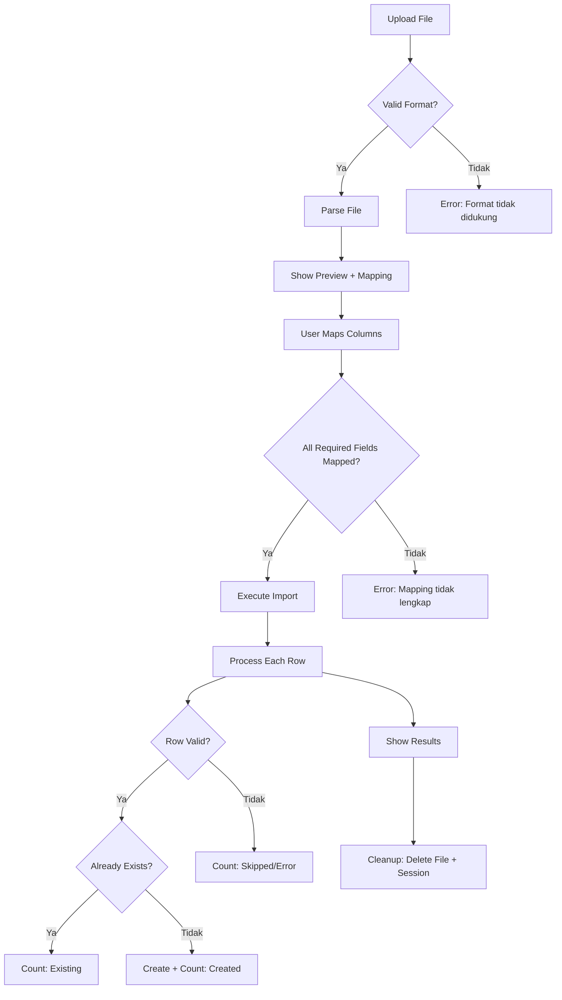

# Product Specification (Product Spec)

## Sistem Manajemen Sekolah Islam (Sekolah Islam) v1.0

---

| Field | Value |
|-------|-------|
| **Nama Produk** | Sekolah Islam |
| **Versi Dokumen** | 1.0 |
| **Tanggal Dibuat** | 27 Agustus 2026 |
| **Referensi** | PRD_SEKOLAH_ISLAM.md |
| **Status** | Aktif |

---

## Daftar Isi

1. [Authentication & Authorization](#1-authentication--authorization)
2. [Master Data — User](#2-master-data--user)
3. [Master Data — Position](#3-master-data--position)
4. [Master Data — Menu](#4-master-data--menu)
5. [Master Data — Closing Period](#5-master-data--closing-period)
6. [Master Data — Division](#6-master-data--division)
7. [Master Data — Level](#7-master-data--level)
8. [Master Data — Grade (Kelas)](#8-master-data--grade-kelas)
9. [Master Data — School Year](#9-master-data--school-year)
10. [Master Data — Religion](#10-master-data--religion)
11. [Master Data — Geographic](#11-master-data--geographic)
12. [Master Data — Residence Type](#12-master-data--residence-type)
13. [Master Data — Hostel](#13-master-data--hostel)
14. [Student Management](#14-student-management)
15. [Student — Study Group](#15-student--study-group)
16. [Teacher Management](#16-teacher-management)
17. [Curriculum — Halaqoh Tahfidz](#17-curriculum--halaqoh-tahfidz)
18. [Curriculum — Halaqoh Lughoh](#18-curriculum--halaqoh-lughoh)
19. [Curriculum — Extracurricular](#19-curriculum--extracurricular)
20. [Import System](#20-import-system)
21. [Export & Print](#21-export--print)
22. [AJAX Endpoints](#22-ajax-endpoints)
23. [Navigation & UI](#23-navigation--ui)
24. [Error Handling Catalog](#24-error-handling-catalog)
25. [Curriculum — Mata Pelajaran, Guru Mapel, Mapel Kelas, & Jadwal Pelajaran](#25-curriculum--mata-pelajaran-guru-mapel-mapel-kelas--jadwal-pelajaran)
26. [Assessment — Nilai Per Kelas](#26-assessment--nilai-per-kelas)
27. [Unimplemented Features Specs](#27-unimplemented-features-specs)

---

## 1. Authentication & Authorization

### 1.1 US-001: User Login

**Story:**
Sebagai pengguna, saya ingin login ke sistem menggunakan User ID dan Password agar saya dapat mengakses fitur sesuai hak akses saya.

**Acceptance Criteria:**
1. Halaman login menampilkan form dengan field User ID dan Password
2. User ID menggunakan field `user_id` (bukan `username`)
3. Password di-hash menggunakan Django default (PBKDF2)
4. Jika login berhasil, redirect ke dashboard (`/`)
5. Jika login gagal, tampilkan pesan error dan tetap di halaman login
6. Form login menggunakan layout fullscreen (`base-fullscreen.html`)
7. CSRF token tersertifikasi di form

**Field Validation Rules:**

| Field | Tipe | Wajib | Max Length | Validasi | Error Message |
|-------|------|-------|------------|----------|---------------|
| user_id | CharField | Ya | 50 | Tidak ada spasi | "User ID wajib diisi" |
| password | PasswordInput | Ya | - | - | "Password wajib diisi" |

**Error Messages:**

| Kode | Pesan | Kondisi |
|------|-------|---------|
| E-AUTH-001 | "User ID atau Password salah" | Kredensial tidak valid |
| E-AUTH-002 | "Akun tidak aktif" | `is_active = False` |
| E-AUTH-003 | "User ID tidak ditemukan" | User ID tidak ada di database |

**UI Specs:**
- Layout: Fullscreen (tanpa sidebar)
- Logo: Sekolah Islam di bagian atas form
- Form: Centered, max-width 400px
- Tombol: "Masuk" (primary button, full-width)
- Link: "Lupa Password?" (opsional, belum diimplementasi)

---

### 1.2 US-002: User Logout

**Story:**
Sebagai pengguna, saya ingin logout dari sistem agar sesi saya berakhir dengan aman.

**Acceptance Criteria:**
1. Tombol logout tersedia di navigation bar
2. Setelah logout, session dihapus
3. Redirect ke halaman login (`/login/`)
4. Tidak bisa mengakses halaman yang memerlukan login setelah logout

---

### 1.3 US-003: Auto-Logout (15 Menit Idle)

**Story:**
Sebagai admin, saya ingin sistem otomatis logout pengguna yang tidak aktif selama 15 menit agar keamanan data terjaga.

**Acceptance Criteria:**
1. Setelah 15 menit tidak ada aktivitas, user otomatis logout
2. User di redirect ke halaman login
3. Pesan: "Sesi Anda telah berakhir. Silakan login kembali."
4. Menggunakan package `django-auto-logout`

**Konfigurasi:**
```python
AUTO_LOGOUT = {
    'SESSION_COOKIE_AGE': 900,  # 15 menit dalam detik
    'MESSAGE': "Sesi Anda telah berakhir.",
    'REDIRECT_TO': '/login/',
}
```

---

### 1.4 US-004: Change Password

**Story:**
Sebagai pengguna, saya ingin mengubah password saya agar akun tetap aman.

**Acceptance Criteria:**
1. Form menampilkan: Password Lama, Password Baru, Konfirmasi Password Baru
2. Password lama harus valid
3. Password baru minimal 8 karakter
4. Konfirmasi harus sama dengan password baru
5. Setelah sukses, session diupdate dan pesan sukses ditampilkan
6. URL: `/master/user/change-password/`

**Field Validation Rules:**

| Field | Tipe | Wajib | Validasi | Error Message |
|-------|------|-------|----------|---------------|
| old_password | PasswordInput | Ya | Harus cocok dengan password saat ini | "Password lama salah" |
| new_password1 | PasswordInput | Ya | Min 8 karakter | "Password baru minimal 8 karakter" |
| new_password2 | PasswordInput | Ya | Harus sama dengan new_password1 | "Konfirmasi password tidak cocok" |

---

### 1.5 US-005: Set Password (Admin)

**Story:**
Sebagai admin, saya ingin mengatur password untuk pengguna lain jika pengguna lupa password.

**Acceptance Criteria:**
1. Hanya admin/superuser yang bisa mengakses
2. Form menampilkan: Password Baru, Konfirmasi Password Baru
3. Target user ditentukan dari URL (`<user_id>`)
4. Password baru langsung diterapkan (tanpa validasi password lama)
5. URL: `/master/user/set-password/<user_id>/`

---

### 1.6 US-006: RBAC Permission Check

**Story:**
Sebagai admin, saya ingin mengatur hak akses per menu untuk setiap user agar pengguna hanya bisa mengakses fitur yang diizinkan.

**Acceptance Criteria:**
1. Setiap user memiliki hak akses per menu (add/edit/delete)
2. Superuser bypass semua pengecekan permission
3. Menu yang tidak bisa diakses ditampilkan sebagai disabled/greyed-out
4. Jika user mencoba mengakses URL tanpa izin, tampilkan halaman 403
5. Decorator `@role_required` diterapkan di setiap view

**Permission Matrix:**

| Menu ID | Add | Edit | Delete | View |
|---------|-----|------|--------|------|
| USER | ✓ | ✓ | ✓ | ✓ |
| POSITION | ✓ | ✓ | ✓ | ✓ |
| MENU | ✓ | ✓ | ✓ | ✓ |
| GRADE | ✓ | ✓ | ✓ | ✓ |
| DATA-SANTRI | ✓ | ✓ | ✓ | ✓ |
| KELAS-SANTRI | ✓ | ✓ | - | ✓ |
| ASRAMA-SANTRI | ✓ | ✓ | - | ✓ |
| ... | ... | ... | ... | ... |

**Error Messages:**

| Kode | Pesan | Kondisi |
|------|-------|---------|
| E-AUTH-010 | "Anda tidak memiliki akses ke halaman ini" | Role tidak sesuai |
| E-AUTH-011 | "Hanya superuser yang bisa mengakses" | Menu khusus superuser |

---

## 2. Master Data — User

### 2.1 US-007: List Users

**Story:**
Sebagai admin, saya ingin melihat daftar semua pengguna agar saya dapat mengelola hak akses.

**Acceptance Criteria:**
1. Tabel menampilkan: User ID, Nama, Email, Posisi
2. Menggunakan DataTables untuk pagination
3. Tombol "Tambah" tersedia jika user memiliki hak akses add
4. Tombol "Edit" dan "Hapus" tersedia di setiap baris
5. Kolom "Aksi" berisi tombol View, Edit, Delete
6. URL: `/master/user/`

**Data Tables Config:**
```javascript
{
    "processing": true,
    "serverSide": false,  // Client-side
    "columns": [
        {"data": "user_id", "title": "User ID"},
        {"data": "username", "title": "Nama"},
        {"data": "email", "title": "Email"},
        {"data": "position_name", "title": "Posisi"},
        {"data": "actions", "title": "Aksi", "orderable": false}
    ]
}
```

---

### 2.2 US-008: Add User

**Story:**
Sebagai admin, saya ingin menambah pengguna baru agar pengguna baru bisa mengakses sistem.

**Acceptance Criteria:**
1. Form menampilkan semua field user
2. Field `user_id` adalah primary key (wajib, unik)
3. Field `password` dan `konfirmasi password` wajib diisi
4. Field `signature` (tanda tangan) opsional
5. Setelah sukses, redirect ke halaman detail user
6. Jika gagal, form tetap terisi dengan error highlights
7. URL: `/master/user/add/`

**Field Validation Rules:**

| Field | Tipe | Wajib | Max Length | Validasi | Error Message |
|-------|------|-------|------------|----------|---------------|
| user_id | CharField | Ya | 50 | Unik, alphanumeric | "User ID sudah digunakan" |
| username | CharField | Ya | 50 | - | "Nama user wajib diisi" |
| email | EmailField | Ya | - | Format email valid | "Format email tidak valid" |
| position | FK | Ya | - | Harus ada di Position | "Posisi wajib dipilih" |
| password1 | PasswordInput | Ya | - | Min 8 karakter | "Password minimal 8 karakter" |
| password2 | PasswordInput | Ya | - | Sama dengan password1 | "Password tidak cocok" |
| signature | ImageField | Tidak | - | Format: JPG, PNG, GIF | "Format gambar tidak didukung" |

**Error Messages:**

| Kode | Pesan | Kondisi |
|------|-------|---------|
| E-USR-001 | "User ID sudah digunakan" | Duplikat user_id |
| E-USR-002 | "Nama user wajib diisi" | username kosong |
| E-USR-003 | "Format email tidak valid" | email tidak valid |
| E-USR-004 | "Posisi wajib dipilih" | position kosong |
| E-USR-005 | "Password minimal 8 karakter" | password < 8 |
| E-USR-006 | "Password tidak cocok" | password1 ≠ password2 |
| E-USR-007 | "Format gambar tidak didukung" | signature bukan gambar |

**Form Layout:**
```
┌─────────────────────────────────────────┐
│ Form Tambah Pengguna                    │
├─────────────────────────────────────────┤
│ User ID:        [________________]      │
│ Nama User:      [________________]      │
│ Email:          [________________]      │
│ Posisi:         [Dropdown________]      │
│                 ──────────────────       │
│ Password:       [________________]      │
│ Konfirmasi:     [________________]      │
│                 ──────────────────       │
│ Tanda Tangan:   [Choose File____]       │
│                 ──────────────────       │
│ [Simpan]  [Batal]                       │
└─────────────────────────────────────────┘
```

---

### 2.3 US-009: View User

**Story:**
Sebagai admin, saya ingin melihat detail pengguna termasuk menu yang sudah di-assign.

**Acceptance Criteria:**
1. Menampilkan semua data user (read-only)
2. Menampilkan daftar menu yang sudah di-assign
3. Form untuk menambah menu baru (checkbox list)
4. Tombol "Assign" untuk menambah menu
5. Tombol "Hapus" untuk menghapus menu dari user
6. URL: `/master/user/view/<user_id>/`

---

### 2.4 US-010: Update User

**Story:**
Sebagai admin, saya ingin mengupdate data pengguna yang sudah ada.

**Acceptance Criteria:**
1. Form terisi dengan data saat ini
2. Field `user_id` tidak bisa diubah (readonly)
3. Field `password` tidak ditampilkan (edit terpisah)
4. Setelah sukses, redirect ke halaman detail
5. URL: `/master/user/update/<user_id>/`

**Field Validation Rules:**
Sama seperti US-008, kecuali:
- `user_id`: readonly (tidak validasi unik)
- `password`: tidak divalidasi (tidak ada di form)

---

### 2.5 US-011: Delete User

**Story:**
Sebagai admin, saya ingin menghapus pengguna yang tidak diperlukan lagi.

**Acceptance Criteria:**
1. Tampilkan konfirmasi dialog sebelum menghapus
2. Tampilkan nama user yang akan dihapus
3. Setelah konfirmasi, data dihapus permanen
4. Redirect ke halaman daftar user
5. URL: `/master/user/delete/<user_id>/`

**Error Messages:**

| Kode | Pesan | Kondisi |
|------|-------|---------|
| E-USR-010 | "User tidak dapat dihapus karena memiliki data terkait" | Foreign key constraint |

---

### 2.6 US-012: Remove Signature

**Story:**
Sebagai admin, saya ingin menghapus tanda tangan digital dari user.

**Acceptance Criteria:**
1. Hanya bisa diakses dari halaman detail user
2. File gambar signature dihapus dari storage
3. Field `signature` di-set ke NULL
4. URL: `/master/user/remove-signature/<user_id>/`

---

### 2.7 US-013: Assign Menu Permissions

**Story:**
Sebagai admin, saya ingin mengatur menu apa saja yang bisa diakses oleh user tertentu.

**Acceptance Criteria:**
1. Ditampilkan di halaman detail user
2. Menu yang belum di-assign ditampilkan sebagai daftar checkbox
3. Setiap menu memiliki checkbox: Add, Edit, Delete
4. Tombol "Simpan" untuk menyimpan perubahan
5. Unique constraint: satu user hanya bisa memiliki satu record per menu
6. URL: `/master/user/view/<user_id>/` (POST)

**Permission Options per Menu:**

| Checkbox | Keterangan |
|----------|------------|
| Add | Bisa menambah data |
| Edit | Bisa mengubah data |
| Delete | Bisa menghapus data |

---

## 3. Master Data — Position

### 3.1 CRUD Specs

| Operasi | URL | Behavior |
|---------|-----|----------|
| Index | `/master/position/` | Daftar semua posisi |
| Add | `/master/position/add/` | Form tambah posisi |
| View | `/master/position/view/<id>/` | Detail posisi (read-only) |
| Update | `/master/position/update/<id>/` | Form edit posisi |
| Delete | `/master/position/delete/<id>/` | Konfirmasi + hapus |

### 3.2 Field Validation Rules

| Field | Tipe | Wajib | Max Length | Validasi | Error Message |
|-------|------|-------|------------|----------|---------------|
| position_id | CharField | Ya | 3 | Unik, uppercase otomatis | "Kode posisi sudah digunakan" |
| position_name | CharField | Ya | 50 | - | "Nama posisi wajib diisi" |

### 3.3 Behavior Notes

- `position_id` otomatis di-uppercase saat save
- Format: 3 karakter (e.g., "MUS" untuk Musrif, "GUR" untuk Guru)

---

## 4. Master Data — Menu

### 4.1 CRUD Specs

| Operasi | URL | Behavior |
|---------|-----|----------|
| Index | `/master/menu/` | Daftar semua menu |
| Add | `/master/menu/add/` | Form tambah menu |
| View | `/master/menu/view/<id>/` | Detail menu |
| Update | `/master/menu/update/<id>/` | Edit menu |
| Delete | `/master/menu/delete/<id>/` | Hapus menu |

### 4.2 Field Validation Rules

| Field | Tipe | Wajib | Max Length | Validasi | Error Message |
|-------|------|-------|------------|----------|---------------|
| menu_id | CharField | Ya | 50 | Unik, uppercase otomatis | "ID menu sudah digunakan" |
| menu_name | CharField | Ya | 50 | - | "Nama menu wajib diisi" |
| menu_remark | CharField | Tidak | 200 | - | - |

---

## 5. Master Data — Closing Period

### 5.1 CRUD Specs

| Operasi | URL | Behavior |
|---------|-----|----------|
| Index | `/master/closing-period/` | Daftar semua periode |
| Add | `/master/closing-period/add/` | Form tambah |
| View | `/master/closing-period/view/<id>/` | Detail |
| Update | `/master/closing-period/update/<id>/` | Edit |
| Delete | `/master/closing-period/delete/<id>/` | Hapus |

### 5.2 Field Validation Rules

| Field | Tipe | Wajib | Max Length | Validasi | Error Message |
|-------|------|-------|------------|----------|---------------|
| document | CharField | Ya | 50 | Unik, uppercase + underscore | "Dokumen sudah ada" |
| year_closed | CharField | Ya | 4 | Angka 4 digit | "Tahun harus 4 digit" |
| month_closed | CharField | Ya | 2 | Angka 01-12 | "Bulan harus 01-12" |
| year_open | CharField | Ya | 4 | Angka 4 digit | "Tahun harus 4 digit" |
| month_open | CharField | Ya | 2 | Angka 01-12 | "Bulan harus 01-12" |

### 5.3 Behavior Notes

- `document` otomatis di-uppercase dan spasi diganti underscore saat save
- Closing period digunakan untuk mengunci data pada periode tertentu

---

## 6. Master Data — Division

### 6.1 Field Validation Rules

| Field | Tipe | Wajib | Validasi | Error Message |
|-------|------|-------|----------|---------------|
| division_id | BigAutoField | Otomatis | - | - |
| division_name | CharField(50) | Ya | - | "Nama bagian wajib diisi" |

---

## 7. Master Data — Level

### 7.1 Field Validation Rules

| Field | Tipe | Wajib | Max Length | Validasi | Error Message |
|-------|------|-------|------------|----------|---------------|
| level_id | CharField | Ya | 3 | Unik, uppercase | "Kode tingkatan sudah digunakan" |
| level_name | CharField | Ya | 50 | - | "Nama tingkatan wajib diisi" |

### 7.2 Contoh Data

| level_id | level_name |
|----------|------------|
| TPA | Taman Pendidikan Al-Quran |
| MI | Madrasah Ibtidaiyah |
| MTs | Madrasah Tsanawiyah |
| MA | Madrasah Aliyah |

---

## 8. Master Data — Grade (Kelas)

### 8.1 US-014: Add Grade

**Story:**
Sebagai admin, saya ingin menambah kelas baru dengan wali kelas dan pengurus kelas.

**Acceptance Criteria:**
1. Form menampilkan: kode kelas, nama kelas, level, tahun ajaran, semester
2. Dropdown wali kelas 1 & 2 (dari daftar teacher)
3. Dropdown ketua kelas, wakil, sekretaris, bendahara (dari daftar student)
4. Setelah sukses, redirect ke daftar kelas
5. URL: `/master/grade/add/`

**Field Validation Rules:**

| Field | Tipe | Wajib | Validasi | Error Message |
|-------|------|-------|----------|---------------|
| grade_id | CharField(7) | Ya | Unik, uppercase | "ID kelas sudah digunakan" |
| grade | CharField(2) | Ya | - | "Kode kelas wajib diisi" |
| grade_name | CharField(50) | Ya | - | "Nama kelas wajib diisi" |
| level | FK → Level | Tidak | - | - |
| school_year | FK → SchoolYear | Tidak | - | - |
| semester | CharField(1) | Tidak | Pilihan: 1 atau 2 | "Semester harus 1 atau 2" |
| homeroom_teacher_1 | FK → Teacher | Tidak | - | - |
| homeroom_teacher_2 | FK → Teacher | Tidak | - | - |
| class_leader | FK → Student | Tidak | - | - |
| vice_class_leader | FK → Student | Tidak | - | - |
| secretary | FK → Student | Tidak | - | - |
| treasurer | FK → Student | Tidak | - | - |

**Form Layout:**
```
┌─────────────────────────────────────────┐
│ Form Tambah Kelas                        │
├─────────────────────────────────────────┤
│ ID Kelas:       [________________]      │
│ Kode Kelas:     [________________]      │
│ Nama Kelas:     [________________]      │
│                 ──────────────────       │
│ Tingkatan:      [Dropdown________]      │
│ Tahun Ajaran:   [Dropdown________]      │
│ Semester:       [○ 1  ○ 2    ]          │
│                 ──────────────────       │
│ Wali Kelas 1:   [Dropdown________]      │
│ Wali Kelas 2:   [Dropdown________]      │
│                 ──────────────────       │
│ Ketua Kelas:    [Dropdown________]      │
│ Wakil Ketua:    [Dropdown________]      │
│ Sekretaris:     [Dropdown________]      │
│ Bendahara:      [Dropdown________]      │
│                 ──────────────────       │
│ [Simpan]  [Batal]                       │
└─────────────────────────────────────────┘
```

---

## 9. Master Data — School Year

### 9.1 Field Validation Rules

| Field | Tipe | Wajib | Validasi | Error Message |
|-------|------|-------|----------|---------------|
| school_year_id | BigAutoField | Otomatis | - | - |
| school_year_name | CharField(9) | Ya | Unik, format "YYYY/YYYY" | "Tahun ajaran sudah ada" |

### 9.2 Contoh Data

| school_year_name |
|------------------|
| 2024/2025 |
| 2025/2026 |
| 2026/2027 |

---

## 10. Master Data — Religion

### 10.1 Field Validation Rules

| Field | Tipe | Wajib | Validasi | Error Message |
|-------|------|-------|----------|---------------|
| religion_id | BigAutoField | Otomatis | - | - |
| religion_name | CharField(50) | Ya | Unik | "Nama agama sudah ada" |

### 10.2 Contoh Data

| religion_name |
|---------------|
| Islam |
| Kristen |
| Katolik |
| Hindu |
| Buddha |
| Konghucu |

---

## 11. Master Data — Geographic

### 11.1 District (Kabupaten/Kota)

**Field Validation Rules:**

| Field | Tipe | Wajib | Validasi | Error Message |
|-------|------|-------|----------|---------------|
| district_id | BigAutoField | Otomatis | - | - |
| district_name | CharField(100) | Ya | Unik, trim whitespace | "Nama kabupaten/kota sudah ada" |

**DataTables Server-Side:**
- URL: `/master/district/data/`
- Columns: ID, Nama Kabupaten/Kota, Aksi
- Server-side pagination
- Search: Global search by name

### 11.2 Sub-District (Kecamatan)

**Field Validation Rules:**

| Field | Tipe | Wajib | Validasi | Error Message |
|-------|------|-------|----------|---------------|
| sub_district_id | BigAutoField | Otomatis | - | - |
| sub_district_name | CharField(100) | Ya | Unik, trim whitespace | "Nama kecamatan sudah ada" |

### 11.3 Village (Desa/Kelurahan)

**Field Validation Rules:**

| Field | Tipe | Wajib | Validasi | Error Message |
|-------|------|-------|----------|---------------|
| village_id | BigAutoField | Otomatis | - | - |
| village_name | CharField(100) | Ya | Unik, trim whitespace | "Nama desa/kelurahan sudah ada" |

---

## 12. Master Data — Residence Type

### 12.1 Field Validation Rules

| Field | Tipe | Wajib | Validasi | Error Message |
|-------|------|-------|----------|---------------|
| residence_type_id | BigAutoField | Otomatis | - | - |
| residence_type_name | CharField(50) | Ya | Unik, trim | "Jenis tinggal sudah ada" |

### 12.2 Contoh Data

| residence_type_name |
|---------------------|
| Asrama |
| Rumah Orang Tua |
| Kos |
| Lainnya |

---

## 13. Master Data — Hostel

### 13.1 Field Validation Rules

| Field | Tipe | Wajib | Validasi | Error Message |
|-------|------|-------|----------|---------------|
| hostel_id | BigAutoField | Otomatis | - | - |
| hostel_name | CharField(50) | Ya | Unik, trim | "Nama asrama sudah ada" |
| musrif | FK → User | Tidak | Harus user dengan posisi "Musrif" | "Musrif harus berposisi Musrif" |

### 13.2 Musrif Assignment Rules

1. Dropdown musrif hanya menampilkan user dengan posisi yang mengandung kata "musrif" (case-insensitive)
2. Menggunakan `limit_choices_to` di model:
```python
limit_choices_to={'position__position_name__icontains': 'musrif'}
```
3. Musrif bisa dikosongkan (nullable)

---

## 14. Student Management

### 14.1 US-017: List Students

**Story:**
Sebagai operator, saya ingin melihat daftar semua santri dengan data lengkap.

**Acceptance Criteria:**
1. Tabel menampilkan: ID, Nama, Jenis Kelamin, Tempat Lahir, Tanggal Lahir, Alamat
2. Menggunakan DataTables untuk pagination dan search
3. Filter berdasarkan: Jenis Kelamin, Kelas, Asrama
4. Tombol "Tambah" untuk menambah santri baru
5. Tombol "Export" untuk export ke Excel
6. Tombol "Print" untuk cetak daftar santri
7. URL: `/santri/`

### 14.2 US-018: Add Student

**Story:**
Sebagai operator, saya ingin menambah data santri baru dengan data diri, orang tua, dan wali.

**Acceptance Criteria:**
1. Form terbagi 3 bagian: Data Diri, Data Orang Tua, Data Wali
2. Field wajib ditandai dengan asterisk (*)
3. Field auto-complete untuk: Kabupaten, Kecamatan, Desa
4. Dynamic dropdown: Kecamatan berdasarkan Kabupaten, Desa berdasarkan Kecamatan
5. Setelah sukses, redirect ke halaman detail santri
6. Jika gagal, form tetap terisi dengan error highlights
7. URL: `/santri/add/`

### 14.3 Student Form Field Specs

#### Section 1: Data Diri

| Field | Tipe | Wajib | Max Length | Validasi | Error Message |
|-------|------|-------|------------|----------|---------------|
| name | CharField | Ya | 100 | - | "Nama wajib diisi" |
| sex | CharField | Ya | 1 | Pilihan: L atau P | "Jenis kelamin wajib dipilih" |
| birth_place | CharField | Ya | 50 | - | "Tempat lahir wajib diisi" |
| birth_date | DateField | Ya | - | Format: YYYY-MM-DD, tidak boleh masa depan | "Tanggal lahir tidak valid" |
| address | CharField | Ya | 200 | - | "Alamat wajib diisi" |
| village | FK → Village | Ya | - | Harus ada di Village | "Desa/Kelurahan wajib dipilih" |
| sub_district | FK → SubDistrict | Ya | - | Harus ada di SubDistrict | "Kecamatan wajib dipilih" |
| district | FK → District | Ya | - | Harus ada di District | "Kabupaten/Kota wajib dipilih" |
| rt | CharField | Ya | 3 | - | "RT wajib diisi" |
| rw | CharField | Ya | 3 | - | "RW wajib diisi" |
| postal_code | CharField | Ya | 10 | - | "Kode pos wajib diisi" |
| residence_type | FK → ResidenceType | Ya | - | Harus ada di ResidenceType | "Jenis tinggal wajib dipilih" |
| phone | CharField | Ya | 15 | - | "Telepon wajib diisi" |
| email | CharField | Tidak | 50 | Format email jika diisi | "Format email tidak valid" |
| religion | FK → Religion | Tidak | - | - | - |
| transportation | CharField | Tidak | 50 | - | - |
| handphone | CharField | Tidak | 15 | - | - |

#### Section 2: Identitas (Opsional)

| Field | Tipe | Wajib | Max Length | Error Message |
|-------|------|-------|------------|---------------|
| shkun_no | CharField | Tidak | 50 | - |
| kps_recipient | CharField | Tidak | 50 | - |
| kps_no | CharField | Tidak | 50 | - |
| nipd | CharField | Tidak | 50 | - |
| nisn | CharField | Tidak | 50 | - |
| nik | CharField | Tidak | 50 | - |

#### Section 3: Data Orang Tua

| Field | Tipe | Wajib | Max Length | Error Message |
|-------|------|-------|------------|---------------|
| father_name | CharField | Tidak | 100 | - |
| father_birth_year | CharField | Tidak | 4 | "Tahun harus 4 digit" |
| father_education | CharField | Tidak | 50 | - |
| father_occupation | CharField | Tidak | 50 | - |
| father_nik | CharField | Tidak | 50 | - |
| father_income | DecimalField | Tidak | 15,2 | "Format nominal tidak valid" |
| mother_name | CharField | Tidak | 100 | - |
| mother_birth_year | CharField | Tidak | 4 | "Tahun harus 4 digit" |
| mother_education | CharField | Tidak | 50 | - |
| mother_occupation | CharField | Tidak | 50 | - |
| mother_nik | CharField | Tidak | 50 | - |
| mother_income | DecimalField | Tidak | 15,2 | "Format nominal tidak valid" |

#### Section 4: Data Wali

| Field | Tipe | Wajib | Max Length | Error Message |
|-------|------|-------|------------|---------------|
| guardian_name | CharField | Tidak | 100 | - |
| guardian_birth_year | CharField | Tidak | 4 | "Tahun harus 4 digit" |
| guardian_education | CharField | Tidak | 50 | - |
| guardian_occupation | CharField | Tidak | 50 | - |
| guardian_nik | CharField | Tidak | 50 | - |
| guardian_income | DecimalField | Tidak | 15,2 | "Format nominal tidak valid" |
| other_info | CharField | Tidak | 200 | - |

### 14.4 Student Form Layout

```
┌─────────────────────────────────────────────────────────┐
│ Form Tambah Santri                                       │
├─────────────────────────────────────────────────────────┤
│ ═══════════════════ DATA DIRI ════════════════════════  │
│ Nama*:           [__________________________________]  │
│ Jenis Kelamin*:  [○ Laki-laki  ○ Perempuan]            │
│ Tempat Lahir*:   [__________________________________]  │
│ Tanggal Lahir*:  [DD/MM/YYYY____]                       │
│ Agama:           [Dropdown________]                      │
│                 ──────────────────────────────────────  │
│ Alamat*:         [__________________________________]  │
│                  [__________________________________]  │
│ Kabupaten*:      [Dropdown/Autocomplete________]        │
│ Kecamatan*:      [Dropdown (filtered)________]          │
│ Desa*:           [Dropdown (filtered)________]          │
│ RT*:             [___]  RW*: [___]  Kode Pos*: [_____]  │
│                 ──────────────────────────────────────  │
│ Jenis Tinggal*:  [Dropdown________]                      │
│ Telepon*:        [__________________________________]  │
│ Email:           [__________________________________]  │
│ Handphone:       [__________________________________]  │
│ Transportasi:    [__________________________________]  │
│ ═══════════════════ IDENTITAS (OPSIONAL) ═════════════  │
│ NISN:            [__________________________________]  │
│ NIK:             [__________________________________]  │
│ NIPD:            [__________________________________]  │
│ No. KPS:         [__________________________________]  │
│ No. SHKUN:       [__________________________________]  │
│ ═══════════════════ DATA AYAH ═══════════════════════  │
│ Nama Ayah:       [__________________________________]  │
│ Tahun Lahir:     [____]  Pendidikan: [Dropdown____]    │
│ Pekerjaan:       [__________________________________]  │
│ NIK:             [__________________________________]  │
│ Penghasilan:     [Rp ________________]                  │
│ ═══════════════════ DATA IBU ════════════════════════  │
│ Nama Ibu:        [__________________________________]  │
│ Tahun Lahir:     [____]  Pendidikan: [Dropdown____]    │
│ Pekerjaan:       [__________________________________]  │
│ NIK:             [__________________________________]  │
│ Penghasilan:     [Rp ________________]                  │
│ ═══════════════════ DATA WALI ═══════════════════════  │
│ Nama Wali:       [__________________________________]  │
│ Tahun Lahir:     [____]  Pendidikan: [Dropdown____]    │
│ Pekerjaan:       [__________________________________]  │
│ NIK:             [__________________________________]  │
│ Penghasilan:     [Rp ________________]                  │
│ Informasi Lain:  [__________________________________]  │
│                 ──────────────────────────────────────  │
│ [Simpan]  [Batal]                                       │
└─────────────────────────────────────────────────────────┘
```

### 14.5 US-019: View Student

**Story:**
Sebagai operator, saya ingin melihat detail santri termasuk data orang tua dan wali.

**Acceptance Criteria:**
1. Menampilkan semua data santri (read-only)
2. Data ditampilkan dalam 4 section (Data Diri, Identitas, Orang Tua, Wali)
3. Tombol "Edit" dan "Hapus" tersedia
4. Menampilkan daftar kelas, asrama, halaqoh yang diikuti
5. URL: `/santri/view/<student_id>/`

### 14.6 US-020: Update Student

**Story:**
Sebagai operator, saya ingin mengupdate data santri yang sudah ada.

**Acceptance Criteria:**
1. Form terisi dengan data saat ini
2. Field validation sama seperti Add Student
3. Setelah sukses, redirect ke halaman detail
4. URL: `/santri/update/<student_id>/`

### 14.7 US-021: Delete Student

**Story:**
Sebagai operator, saya ingin menghapus data santri yang tidak diperlukan lagi.

**Acceptance Criteria:**
1. Tampilkan konfirmasi dialog
2. Tampilkan nama santri yang akan dihapus
3. Setelah konfirmasi, data dihapus
4. URL: `/santri/delete/<student_id>/`

**Error Messages:**

| Kode | Pesan | Kondisi |
|------|-------|---------|
| E-STU-010 | "Santri tidak dapat dihapus karena terdaftar di kelas" | FK constraint |
| E-STU-011 | "Santri tidak dapat dihapus karena terdaftar di halaqoh" | FK constraint |

---

### 14.8 US-022: Assign Student to Grade

**Story:**
Sebagai operator, saya ingin menambahkan santri ke dalam kelas tertentu.

**Acceptance Criteria:**
1. Halaman menampilkan daftar kelas
2. Klik kelas → lihat daftar santri di kelas tersebut
3. Tombol "Tambah Santri" menampilkan daftar santri yang belum di kelas
4. Pilih santri → klik "Simpan"
5. Santri terdaftar di kelas
6. URL: `/santri/per-kelas/<grade_id>/add-student/`

**Behaviors:**
- Satu santri hanya bisa berada di satu kelas (grade FK di Student)
- Jika santri sudah ada di kelas lain, pindahkan ke kelas baru

### 14.9 US-023: Remove Student from Grade

**Story:**
Sebagai operator, saya ingin mengeluarkan santri dari kelas.

**Acceptance Criteria:**
1. Di halaman detail kelas, setiap santri memiliki tombol "Hapus"
2. Klik "Hapus" → konfirmasi
3. Field `grade` santri di-set ke NULL
4. URL: `/santri/per-kelas/<grade_id>/remove/<student_id>/`

---

### 14.10 US-024: Assign Student to Hostel

**Story:**
Sebagai operator, saya ingin menempatkan santri ke asrama tertentu.

**Acceptance Criteria:**
1. Halaman menampilkan daftar asrama
2. Klik asrama → lihat daftar santri di asrama tersebut
3. Tombol "Tambah Santri" menampilkan daftar santri yang belum di asrama
4. Pilih santri → klik "Simpan"
5. Santri terdaftar di asrama
6. URL: `/santri/per-asrama/<hostel_id>/add-student/`

**Behaviors:**
- Satu santri hanya bisa berada di satu asrama
- Field `hostel` di Student di-update

### 14.11 US-025: Remove Student from Hostel

**Story:**
Sebagai operator, saya ingin mengeluarkan santri dari asrama.

**Acceptance Criteria:**
1. Tombol "Hapus" di halaman detail asrama
2. Konfirmasi sebelum menghapus
3. Field `hostel` di-set ke NULL
4. URL: `/santri/per-asrama/<hostel_id>/remove/<student_id>/`

---

### 14.12 US-026/027: Halaqoh Tahfidz Assignment

**Behavior:**
- Menggunakan tabel Many-to-Many `HalaqohTahfidzMember`
- Satu santri bisa berada di satu halaqoh tahfidz
- Unique constraint: `(halaqoh, student)`

**Endpoints:**
| URL | Fungsi |
|-----|--------|
| `/santri/per-halaqoh-tahfidz/<id>/add-student/` | Tambah santri |
| `/santri/per-halaqoh-tahfidz/<id>/remove/<student_id>/` | Hapus santri |

### 14.13 US-028/029: Halaqoh Lughoh Assignment

**Behavior:**
Sama seperti Tahfidz, menggunakan `HalaqohLughohMember`.

### 14.14 US-030/031: Extracurricular Assignment

**Behavior:**
Sama seperti Halaqoh, menggunakan `ExtracurricularMember`.

---

## 15. Student — Study Group

### 15.1 US-032: Create Study Group

**Story:**
Sebagai operator, saya ingin membuat kelompok belajar untuk mengelompokkan santri berdasarkan kriteria tertentu.

**Acceptance Criteria:**
1. Form menampilkan: nama kelompok, divisi (1-10), guru kelompok, tahun ajaran
2. Setelah sukses, redirect ke halaman detail kelompok
3. URL: `/santri/kelompok-belajar/add/`

**Field Validation Rules:**

| Field | Tipe | Wajib | Validasi | Error Message |
|-------|------|-------|----------|---------------|
| group_name | CharField(100) | Ya | - | "Nama kelompok wajib diisi" |
| group_division | CharField(2) | Tidak | Pilihan: 1-10 | - |
| group_teacher | FK → Teacher | Tidak | - | - |
| school_year | FK → SchoolYear | Tidak | - | - |

### 15.2 US-033: Update Study Group

**Story:**
Sebagai operator, saya ingin mengupdate data kelompok belajar.

**Acceptance Criteria:**
1. Form terisi dengan data saat ini
2. Setelah sukses, redirect ke halaman detail
3. URL: `/santri/kelompok-belajar/<id>/update/`

### 15.3 US-034: Delete Study Group

**Story:**
Sebagai operator, saya ingin menghapus kelompok belajar.

**Acceptance Criteria:**
1. Konfirmasi sebelum menghapus
2. Semua anggota kelompok juga dihapus (cascade)
3. URL: `/santri/kelompok-belajar/<id>/delete/`

### 15.4 US-035: Add Student to Group

**Story:**
Sebagai operator, saya ingin menambahkan santri ke kelompok belajar.

**Acceptance Criteria:**
1. Tombol "Tambah Santri" di halaman detail kelompok
2. Dropdown/daftar santri yang belum di kelompok ini
3. Klik "Simpan" → santri terdaftar
4. URL: `/santri/kelompok-belajar/<group_id>/add-student/`

**Unique Constraint:**
```python
class Meta:
    unique_together = ('study_group', 'student')
```

### 15.5 US-036: Remove Student from Group

**Story:**
Sebagai operator, saya ingin mengeluarkan santri dari kelompok belajar.

**Acceptance Criteria:**
1. Tombol "Hapus" di halaman detail kelompok
2. Konfirmasi sebelum menghapus
3. URL: `/santri/kelompok-belajar/<group_id>/remove/<student_id>/`

---

## 16. Teacher Management

### 16.1 US-037: List Teachers

**Story:**
Sebagai admin, saya ingin melihat daftar semua guru.

**Acceptance Criteria:**
1. Tabel menampilkan: ID, Nama, NIP, Jenis Kelamin, Status
2. Tombol "Tambah" untuk menambah guru baru
3. URL: `/kurikulum/guru/`

### 16.2 US-038: Add Teacher

**Story:**
Sebagai admin, saya ingin menambah data guru baru.

**Acceptance Criteria:**
1. Form menampilkan semua field guru
2. Field `user` (opsional) untuk link ke akun pengguna
3. Setelah sukses, redirect ke halaman detail guru
4. URL: `/kurikulum/guru/add/`

**Field Validation Rules:**

| Field | Tipe | Wajib | Validasi | Error Message |
|-------|------|-------|----------|---------------|
| user | FK → User | Tidak | Unik (OneToOne), bisa kosong | "User sudah terhubung ke guru lain" |
| nip | CharField(30) | Tidak | - | - |
| sex | CharField(1) | Ya | Pilihan: L atau P | "Jenis kelamin wajib dipilih" |
| birth_place | CharField(50) | Tidak | - | - |
| birth_date | DateField | Tidak | - | - |
| address | CharField(200) | Tidak | - | - |
| phone | CharField(20) | Tidak | - | - |
| email | CharField(100) | Tidak | Format email | "Format email tidak valid" |
| status | CharField(3) | Tidak | Pilihan: GTY, GTT, PNS | - |
| specialization | CharField(100) | Tidak | - | - |
| last_education | CharField(5) | Tidak | Pilihan: SD, SMP, SMA, D1-D4, S1-S3 | - |
| last_school | CharField(200) | Tidak | - | - |
| last_school_major | CharField(100) | Tidak | - | - |

**User Linking Behavior:**
1. Field `user` menggunakan `OneToOneField` → satu user hanya bisa link ke satu guru
2. Jika user sudah terhubung ke guru lain, tampilkan error
3. Guru bisa dibuat tanpa link ke user (opsional)

### 16.3 US-039: View Teacher

**Acceptance Criteria:**
1. Menampilkan semua data guru (read-only)
2. Menampilkan link ke akun user (jika ada)
3. URL: `/kurikulum/guru/view/<teacher_id>/`

### 16.4 US-040: Update Teacher

**Acceptance Criteria:**
1. Form terisi dengan data saat ini
2. Field `user` bisa diubah
3. URL: `/kurikulum/guru/update/<teacher_id>/`

### 16.5 US-041: Delete Teacher

**Acceptance Criteria:**
1. Konfirmasi sebelum menghapus
2. Error jika guru masih terdaftar sebagai wali kelas atau halaqoh
3. URL: `/kurikulum/guru/delete/<teacher_id>/`

**Error Messages:**

| Kode | Pesan | Kondisi |
|------|-------|---------|
| E-TCH-010 | "Guru tidak dapat dihapus karena masih menjadi wali kelas" | FK constraint |
| E-TCH-011 | "Guru tidak dapat dihapus karena masih mengajar halaqoh" | FK constraint |

---

## 17. Curriculum — Halaqoh Tahfidz

### 17.1 US-042: Create Halaqoh

**Story:**
Sebagai admin, saya ingin membuat halaqoh tahfidz baru.

**Acceptance Criteria:**
1. Form menampilkan: guru halaqoh, kelas
2. Guru diambil dari daftar teacher
3. Kelas diambil dari daftar grade
4. Setelah sukses, redirect ke daftar halaqoh
5. URL: `/kurikulum/halaqoh-tahfidz/add/`

**Field Validation Rules:**

| Field | Tipe | Wajib | Validasi | Error Message |
|-------|------|-------|----------|---------------|
| teacher | FK → Teacher | Tidak | - | - |
| grade | FK → Grade | Tidak | - | - |

### 17.2 US-043: Update Halaqoh

**Acceptance Criteria:**
1. Form terisi dengan data saat ini
2. URL: `/kurikulum/halaqoh-tahfidz/<id>/update/`

### 17.3 US-044: Delete Halaqoh

**Acceptance Criteria:**
1. Konfirmasi sebelum menghapus
2. Semua anggota halaqoh juga dihapus (cascade)
3. URL: `/kurikulum/halaqoh-tahfidz/<id>/delete/`

### 17.4 US-045: Add Member

**Story:**
Sebagai admin, saya ingin menambahkan santri ke halaqoh tahfidz.

**Acceptance Criteria:**
1. Tombol "Tambah Santri" di halaman detail halaqoh
2. Daftar santri yang belum di halaqoh ini
3. Unique constraint: satu santri hanya bisa di satu halaqoh tahfidz
4. URL: `/kurikulum/halaqoh-tahfidz/<id>/add-student/`

### 17.5 US-046: Remove Member

**Acceptance Criteria:**
1. Tombol "Hapus" di halaman detail halaqoh
2. Konfirmasi sebelum menghapus
3. URL: `/kurikulum/halaqoh-tahfidz/<id>/remove/<student_id>/`

---

## 18. Curriculum — Halaqoh Lughoh

Sama seperti Halaqoh Tahfidz (Section 17), dengan URL prefix `/kurikulum/halaqoh-lughoh/`.

---

## 19. Curriculum — Extracurricular

### 19.1 US-047: Create Extracurricular

**Story:**
Sebagai admin, saya ingin membuat ekstrakurikuler baru.

**Acceptance Criteria:**
1. Form menampilkan: nama ekskul, penanggung jawab (guru)
2. Setelah sukses, redirect ke daftar ekskul
3. URL: `/kurikulum/ekskul/add/`

**Field Validation Rules:**

| Field | Tipe | Wajib | Validasi | Error Message |
|-------|------|-------|----------|---------------|
| name | CharField(100) | Ya | - | "Nama ekskul wajib diisi" |
| teacher | FK → Teacher | Tidak | - | - |

### 19.2 US-048/049: Update/Delete

Sama seperti pattern CRUD lainnya.

### 19.3 US-050: Add Member

**Acceptance Criteria:**
1. Tombol "Tambah Santri" di halaman detail ekskul
2. Daftar santri yang belum di ekskul ini
3. Unique constraint: `(extracurricular, student)`
4. URL: `/kurikulum/ekskul/<id>/add-student/`

### 19.4 US-051: Remove Member

**Acceptance Criteria:**
1. Tombol "Hapus" di halaman detail ekskul
2. URL: `/kurikulum/ekskul/<id>/remove/<student_id>/`

---

## 20. Import System

### 20.1 US-052: Upload File

**Story:**
Sebagai operator, saya ingin mengimport data geografis dari file Excel/CSV.

**Acceptance Criteria:**
1. Form upload menampilkan: pilih file (.xlsx atau .csv), tombol "Upload"
2. Maksimal ukuran file: 10MB
3. Setelah upload, tampilkan preview 5 baris pertama
4. Tampilkan header kolom dari file
5. URL: `/master/<entity>/import/`

**File Format Specs:**

| Aspek | Spesifikasi |
|-------|------------|
| Format yang didukung | .xlsx, .csv |
| Maksimal ukuran | 10MB |
| Encoding (CSV) | UTF-8, UTF-8-BOM, Latin-1 (auto-detect) |
| Delimiter (CSV) | Auto-detect (koma, titik koma) |
| Sheet (XLSX) | Sheet pertama |

### 20.2 US-053: Map Columns

**Story:**
Sebagai operator, saya ingin memetakan kolom file ke field目标.

**Acceptance Criteria:**
1. Menampilkan daftar kolom file (header dari file)
2. Menampilkan daftar field目标 (dari konfigurasi)
3. Dropdown mapping: field_target → kolom_file
4. Auto-suggestion berdasarkan alias field
5. Preview data tetap terlihat
6. Tombol "Import" untuk memproses
7. Tombol "Batal" untuk membatalkan

**Auto-Suggestion Algorithm:**

```python
def suggest_mapping(field_name, headers):
    aliases = FIELD_ALIASES[field_name]
    for header in headers:
        normalized = normalize(header)
        if normalized in aliases:
            return header
        for alias in aliases:
            if alias in normalized or normalized in alias:
                return header
    return None
```

**Field Aliases:**

| Field | Aliases |
|-------|---------|
| district_name | district, kabupaten, kabupaten kota, kab/kota, kota, nama kabupaten |
| sub_district_name | sub district, subdistrict, kecamatan, nama kecamatan |
| village_name | village, desa, kelurahan, desa/kelurahan, nama desa |

### 20.3 US-054: Execute Import

**Story:**
Sebagai operator, saya ingin memproses import data.

**Acceptance Criteria:**
1. Klik "Import" → konfirmasi
2. Proses dilakukan dalam transaction (atomic)
3. Progress bar ditampilkan (opsional)
4. Hasil import ditampilkan: created, existing, skipped, errors
5. Error detail ditampilkan (maksimal 20 error pertama)
6. File temporary dihapus setelah import selesai
7. Session import dihapus

**Import Flow Diagram:**



**Result Messages:**

| Kode | Pesan | Kondisi |
|------|-------|---------|
| I-IMP-001 | "Import selesai. Data baru: {n}, sudah ada: {n}, dilewati: {n}." | Sukses |
| I-IMP-002 | "Import selesai dengan error: {n} baris." | Ada error |
| I-IMP-003 | "File tidak berisi data." | File kosong |
| I-IMP-004 | "Format file harus .xlsx atau .csv" | Format salah |
| I-IMP-005 | "File CSV tidak dapat dibaca." | Encoding error |
| I-IMP-006 | "Sesi import sudah habis. Silakan upload ulang." | Session expired |

**Error Handling per Row:**

| Error Type | Behavior |
|------------|----------|
| Duplicate | Count as "existing", skip |
| Empty row | Count as "skipped" |
| Invalid data | Count as "error", log message |
| Database error | Count as "error", log message |

### 20.4 Session Management

```python
# Session key pattern
f'import_master_{master_key}'

# Session data structure
{
    'extension': '.xlsx',
    'headers': ['Kolom 1', 'Kolom 2', ...],
    'data_rows': [['val1', 'val2', ...], ...],
    'original_name': 'file.xlsx',
}
```

- Session dihapus setelah import selesai atau dibatalkan
- File temporary dihapus dari `MEDIA_ROOT/import_temp/`

---

## 21. Export & Print

### 21.1 US-055: Export Excel

**Story:**
Sebagai operator, saya ingin mengekspor data ke Excel.

**Acceptance Criteria:**
1. Tombol "Export" di halaman daftar
2. File di-download otomatis
3. Format: .xls (xlwt) atau .xlsx (xlsxwriter)
4. Kolom sesuai dengan yang ditampilkan di tabel

**Excel Column Mapping:**

| Entity | Columns |
|--------|---------|
| Student | ID, Nama, JK, Tempat Lahir, Tanggal Lahir, Alamat, Kelas, Asrama |
| Teacher | ID, Nama, NIP, JK, Status, Keahlian |
| Grade | ID, Nama, Level, Tahun Ajaran, Semester, Wali Kelas |

### 21.2 US-056: Print PDF

**Story:**
Sebagai operator, saya ingin mencetak data dalam format PDF.

**Acceptance Criteria:**
1. Tombol "Cetak" di halaman daftar atau detail
2. PDF di-download atau dibuka di tab baru
3. Layout: A4 landscape
4. Header: Logo sekolah + judul
5. Footer: Tanggal cetak + tanda tangan digital

**PDF Template Specs:**

```
┌─────────────────────────────────────────────────────────┐
│ [Logo]  NAMA SEKOLAH                                     │
│         Alamat Sekolah                                   │
│         ──────────────────────────────────────────────  │
│                                                          │
│         JUDUL CETAKAN                                    │
│         Periode: ...                                     │
│                                                          │
│ ┌──────┬──────────┬──────────┬──────────┬──────────┐    │
│ │ No.  │ Nama     │ Kelas    │ Asrama   │ Status   │    │
│ ├──────┼──────────┼──────────┼──────────┼──────────┤    │
│ │ 1    │ Ahmad    │ VII-A    │ Asrama 1 │ Aktif    │    │
│ │ 2    │ Budi     │ VII-B    │ Asrama 2 │ Aktif    │    │
│ │ ...  │ ...      │ ...      │ ...      │ ...      │    │
│ └──────┴──────────┴──────────┴──────────┴──────────┘    │
│                                                          │
│                                                    ───  │
│                                                    TTD   │
│                                                          │
│ Dicetak pada: 27 Agustus 2026 14:30                     │
└─────────────────────────────────────────────────────────┘
```

### 21.3 US-057: Digital Signature

**Story:**
Sebagai admin, saya ingin menggunakan tanda tangan digital pada dokumen cetak.

**Acceptance Criteria:**
1. Tanda tangan diupload sebagai gambar (JPG/PNG)
2. Tersimpan di `media/signature/`
3. Ditampilkan di dokumen PDF
4. Bisa dihapus dan diganti

---

## 22. AJAX Endpoints

### 22.1 Dynamic Dropdowns

**Endpoint: Get Sub-Districts**

| Aspek | Detail |
|-------|--------|
| URL | `/santri/ajax/sub-districts/` |
| Method | GET |
| Parameter | `district_id` |
| Response | JSON Array |

**Request:**
```
GET /santri/ajax/sub-districts/?district_id=1
```

**Response:**
```json
[
    {"id": 1, "name": "Kecamatan A"},
    {"id": 2, "name": "Kecamatan B"}
]
```

**Endpoint: Get Villages**

| Aspek | Detail |
|-------|--------|
| URL | `/santri/ajax/villages/` |
| Method | GET |
| Parameter | `sub_district_id` |
| Response | JSON Array |

### 22.2 Autocomplete

**Endpoint: District Autocomplete**

| Aspek | Detail |
|-------|--------|
| URL | `/santri/ajax/district-autocomplete/` |
| Method | GET |
| Parameter | `term` (search query) |
| Response | JSON Array |

**Request:**
```
GET /santri/ajax/district-autocomplete/?term=ban
```

**Response:**
```json
[
    {"id": 1, "label": "Bandung", "value": "Bandung"},
    {"id": 2, "label": "Banjar", "value": "Banjar"}
]
```

### 22.3 DataTables Server-Side

**Endpoint: District Data**

| Aspek | Detail |
|-------|--------|
| URL | `/master/district/data/` |
| Method | GET |
| Parameters | `draw`, `start`, `length`, `search[value]`, `order[0][column]`, `order[0][dir]` |
| Response | JSON (DataTables format) |

**Response:**
```json
{
    "draw": 1,
    "recordsTotal": 100,
    "recordsFiltered": 100,
    "data": [
        ["1", "Kabupaten A", "<a href='...'>Edit</a>"],
        ["2", "Kabupaten B", "<a href='...'>Edit</a>"]
    ]
}
```

### 22.4 Nilai Per Kelas

**Endpoint: Opsi Guru & Mapel**

| Aspek | Detail |
|-------|--------|
| URL | `/nilai/kelas/ajax/options/` |
| Method | GET |
| Parameter | `grade_id` |
| Response | JSON `{data: [...]}` |

**Response:**
```json
{
    "data": [
        {
            "id": 12,
            "teacher_id": "1",
            "teacher_name": "Ustadz Abdurrahman",
            "subject_id": "MT01",
            "subject_name": "Al-Quran Hadits"
        }
    ]
}
```

**Endpoint: Simpan Nilai**

| Aspek | Detail |
|-------|--------|
| URL | `/nilai/kelas/ajax/save/` |
| Method | POST |
| Content-Type | `application/json` |
| Header | `X-CSRFToken` |
| Body | `teacher_subject`, `semester`, `school_year`, `scores: [{student_id, score1, score2, score3}]` |
| Response | Sukses: `{"success": true, "count": n}`; Gagal: `{"success": false, "message": "..."}` + status 400/405 |

---

## 23. Navigation & UI

### 23.1 Sidebar Behavior

1. **Collapse/Expand:** Klik judul group untuk expand/collapse
2. **State Persistence:** Status collapse disimpan di `sessionStorage`
3. **Active State:** Menu aktif ditandai dengan highlight
4. **Disabled State:** Menu yang tidak bisa diakses ditampilkan greyed-out
5. **Mobile:** Sidebar menggunakan `django-user-agents` untuk deteksi

### 23.2 Responsive Breakpoints

| Breakpoint | Behavior |
|------------|----------|
| ≥ 1200px | Sidebar tetap visible |
| < 1200px | Sidebar bisa di-toggle |
| Mobile | Sidebar overlay, hamburger menu |

### 23.3 Theme Switcher

- Tombol theme switcher di `includes/fixed-plugin.html`
- Mendukung light/dark mode
- State disimpan di localStorage

### 23.4 DataTables Defaults

```javascript
{
    "language": {
        "search": "Cari:",
        "lengthMenu": "Tampilkan _MENU_ data",
        "info": "Menampilkan _START_ - _END_ dari _TOTAL_ data",
        "infoEmpty": "Tidak ada data",
        "infoFiltered": "(difilter dari _MAX_ total data)",
        "zeroRecords": "Tidak ada data yang cocok",
        "paginate": {
            "first": "Pertama",
            "last": "Terakhir",
            "next": "Selanjutnya",
            "previous": "Sebelumnya"
        }
    },
    "pageLength": 10,
    "lengthMenu": [10, 25, 50, 100]
}
```

---

## 24. Error Handling Catalog

### 24.1 Validation Errors

| Kode | Pesan | Kondisi |
|------|-------|---------|
| E-VAL-001 | "Field ini wajib diisi" | Field required kosong |
| E-VAL-002 | "Format tidak valid" | Invalid format (email, date, etc.) |
| E-VAL-003 | "Maksimal {n} karakter" | Melebihi max length |
| E-VAL-004 | "Minimal {n} karakter" | Kurang dari min length |
| E-VAL-005 | "Nilai sudah ada" | Unique constraint |
| E-VAL-006 | "Nilai tidak valid" | Invalid choice |
| E-VAL-007 | "Nilai harus berupa angka" | Nilai bukan numerik saat simpan nilai |
| E-VAL-008 | "Nilai harus antara 0 dan 100" | Nilai di luar rentang 0–100 |
| E-VAL-009 | "Semester tidak valid" | Semester di luar pilihan 1/2 |

### 24.2 Business Logic Errors

| Kode | Pesan | Kondisi |
|------|-------|---------|
| E-BIZ-001 | "Data tidak dapat dihapus karena masih digunakan" | FK constraint |
| E-BIZ-002 | "Data tidak dapat dihapus karena masih memiliki anggota" | Cascade constraint |
| E-BIZ-003 | "User sudah terhubung ke data lain" | OneToOne constraint |
| E-BIZ-004 | "Menu sudah di-assign ke user ini" | Unique constraint |
| E-BIZ-005 | "Lengkapi semua filter lalu klik Search." | Filter nilai belum lengkap (US-078) |
| E-BIZ-006 | "Guru tidak terdaftar untuk mapel dan kelas tersebut. Pilih kombinasi lain." | Tidak ada `TeacherSubject` untuk kombinasi filter (US-078) |
| E-BIZ-007 | "Filter nilai tidak valid, silakan ulangi pencarian" | `TeacherSubject`/`SchoolYear` tidak ditemukan saat simpan (US-080) |
| E-BIZ-008 | "Format data tidak valid" | Body JSON rusak pada `/nilai/kelas/ajax/save/` (US-080) |

### 24.3 System Errors

| Kode | Pesan | Kondisi |
|------|-------|---------|
| E-SYS-001 | "Terjadi kesalahan sistem. Silakan coba lagi." | Server error |
| E-SYS-002 | "Sesi telah berakhir. Silakan login kembali." | Session expired |
| E-SYS-003 | "File terlalu besar. Maksimal 10MB." | Upload size limit |
| E-SYS-004 | "Format file tidak didukung." | Invalid file type |

### 24.4 HTTP Error Pages

| Status | Template | Pesan |
|--------|----------|-------|
| 403 | `home/forbidden.html` | "Anda tidak memiliki akses ke halaman ini" |
| 404 | - | "Halaman tidak ditemukan" |
| 500 | - | "Terjadi kesalahan server" |

---

## 25. Curriculum — Mata Pelajaran, Guru Mapel, Mapel Kelas, & Jadwal Pelajaran

> **Status: Aktif** — Semua fitur berikut sudah diimplementasi.

---

### 25.1 US-058: Mata Pelajaran (Subjects)

**Model yang direncanakan:**

```python
class Subject(models.Model):
    subject_id = models.CharField(max_length=10, primary_key=True)
    subject_name = models.CharField(max_length=100)
    description = models.TextField(blank=True)
```

**Endpoints yang direncanakan:**

| URL | Fungsi |
|-----|--------|
| `/kurikulum/mapel/` | Daftar mata pelajaran |
| `/kurikulum/mapel/add/` | Tambah mata pelajaran |
| `/kurikulum/mapel/<id>/` | Detail mata pelajaran |
| `/kurikulum/mapel/<id>/update/` | Edit mata pelajaran |
| `/kurikulum/mapel/<id>/delete/` | Hapus mata pelajaran |

---

### 25.2 US-059: Guru Per Mapel (TeacherSubject)

**Story:**
Sebagai admin, saya ingin menetapkan guru pengampu untuk setiap mapel di kelas beserta jumlah jam mengajar.

**Acceptance Criteria:**
1. Tabel menampilkan: ID, Guru, Kelas, Mapel, Jam/Minggu
2. Tombol "Tambah" untuk menambah penugasan baru
3. URL: `/kurikulum/guru-mapel/`

**Field Validation Rules:**

| Field | Tipe | Wajib | Validasi | Error Message |
|-------|------|-------|----------|---------------|
| teacher_subject_id | BigAutoField | Otomatis | - | - |
| teacher | FK → Teacher | Ya | - | "Guru wajib dipilih" |
| grade_subject | FK → GradeSubject | Ya | - | "Mapel kelas wajib dipilih" |
| hours | IntegerField | Ya | Min 1 | "Jam minimal 1" |

**CRUD Endpoints:**

| Operasi | URL | Behavior |
|---------|-----|----------|
| Index | `/kurikulum/guru-mapel/` | Daftar penugasan guru-mapel |
| Add | `/kurikulum/guru-mapel/add/` | Form tambah |
| View | `/kurikulum/guru-mapel/view/<id>/` | Detail |
| Update | `/kurikulum/guru-mapel/update/<id>/` | Edit |
| Delete | `/kurikulum/guru-mapel/delete/<id>/` | Hapus |

---

### 25.3 US-060: Mapel Per Kelas (GradeSubject)

**Story:**
Sebagai admin, saya ingin menetapkan mata pelajaran dan ruangan default untuk setiap kelas.

**Acceptance Criteria:**
1. Tabel menampilkan: ID, Kelas, Mapel, Ruangan, Keterangan
2. Tombol "Tambah" untuk menambah penugasan baru
3. URL: `/kurikulum/mapel-kelas/`

**Field Validation Rules:**

| Field | Tipe | Wajib | Validasi | Error Message |
|-------|------|-------|----------|---------------|
| grade_subject_id | BigAutoField | Otomatis | - | - |
| grade | FK → Grade | Ya | - | "Kelas wajib dipilih" |
| subject | FK → Subject | Ya | - | "Mapel wajib dipilih" |
| room | FK → Room | Tidak | - | - |
| keterangan | CharField(200) | Tidak | - | - |

**CRUD Endpoints:**

| Operasi | URL | Behavior |
|---------|-----|----------|
| Index | `/kurikulum/mapel-kelas/` | Daftar mapel per kelas |
| Add | `/kurikulum/mapel-kelas/add/` | Form tambah |
| View | `/kurikulum/mapel-kelas/view/<id>/` | Detail |
| Update | `/kurikulum/mapel-kelas/update/<id>/` | Edit |
| Delete | `/kurikulum/mapel-kelas/delete/<id>/` | Hapus |

---

### 25.4 US-061: Ruangan (Room)

**Story:**
Sebagai admin, saya ingin mengelola data ruangan untuk keperluan penjadwalan.

**Acceptance Criteria:**
1. Tabel menampilkan: ID, Nama Ruangan
2. Tombol "Tambah" untuk menambah ruangan baru
3. URL: `/kurikulum/ruangan/`

**Field Validation Rules:**

| Field | Tipe | Wajib | Validasi | Error Message |
|-------|------|-------|----------|---------------|
| room_id | BigAutoField | Otomatis | - | - |
| room_name | CharField(100) | Ya | Unik | "Nama ruangan sudah ada" |

**CRUD Endpoints:**

| Operasi | URL | Behavior |
|---------|-----|----------|
| Index | `/kurikulum/ruangan/` | Daftar ruangan |
| Add | `/kurikulum/ruangan/add/` | Form tambah |
| View | `/kurikulum/ruangan/view/<id>/` | Detail |
| Update | `/kurikulum/ruangan/update/<id>/` | Edit |
| Delete | `/kurikulum/ruangan/delete/<id>/` | Hapus |

---

### 25.5 US-062: Jadwal Pelajaran (Timetable) — Index

**Story:**
Sebagai admin, saya ingin melihat daftar semua jadwal pelajaran yang sudah dibuat.

**Acceptance Criteria:**
1. Tabel menampilkan: ID, Nama Jadwal, Tahun Ajaran, Semester, Status (draft/published)
2. Kolom Semester menampilkan "Ganjil" atau "Genap"
3. Tombol "Tambah Jadwal" untuk membuat jadwal baru
4. Tombol "Lihat Jadwal" untuk membuka grid view
5. Tombol "Edit" dan "Hapus" tersedia
6. URL: `/kurikulum/jadwal/`

**Field Validation Rules (Timetable):**

| Field | Tipe | Wajib | Validasi | Error Message |
|-------|------|-------|----------|---------------|
| timetable_id | BigAutoField | Otomatis | - | - |
| name | CharField(100) | Ya | - | "Nama jadwal wajib diisi" |
| school_year | FK → SchoolYear | Ya | - | "Tahun ajaran wajib dipilih" |
| semester | CharField(1) | Ya | Pilihan: 1 atau 2 | "Semester wajib dipilih" |
| status | CharField(10) | Tidak | Default: draft | - |
| notes | TextField | Tidak | - | - |

**Semester Choices:**

| Code | Label |
|------|-------|
| 1 | Ganjil |
| 2 | Genap |

---

### 25.6 US-063: Jadwal Pelajaran — Grid View

**Story:**
Sebagai admin, saya ingin melihat jadwal dalam format grid interaktif agar mudah mengatur penjadwalan.

**Acceptance Criteria:**
1. Grid menampilkan jadwal dalam format tabel (kolom = periode, baris = kelas/guru/ruangan)
2. 6 mode tampilan tersedia: Kelas Standar, Kelas Kompak, Guru Standar, Guru Kompak, Ruangan Standar, Ruangan Kompak
3. Panel "Belum Dijadwalkan" menampilkan mapel yang belum dijadwalkan
4. Drag-and-drop untuk menjadwalkan, memindahkan, dan menghapus slot
5. Filter berdasarkan kelas, guru, atau ruangan
6. Mode dan view tersimpan di localStorage
7. Badge semester (Ganjil/Genap) ditampilkan di header
8. **Kelas tanpa TeacherSubject di tahun ajaran/semester ini tidak ditampilkan** (sudah difilter di view)
9. **Card "Analisis Beban Mengajar" menampilkan statistik pemanfaatan guru/ruangan** di atas grid
10. **Tombol "Export PDF"** tersedia di header grid
11. **Alert peringatan** muncul jika tahun ajaran atau semester belum diatur
12. URL: `/kurikulum/jadwal/<id>/grid/`

**View Modes:**

| Mode | Struktur | Keterangan |
|------|----------|------------|
| Kelas Standar | 1 tabel, baris = kelas, kolom = periode (grouped per hari) | Header periode merged per hari |
| Kelas Kompak | 1 tabel per kelas, baris = hari | Header: Hari + kolom periode |
| Guru Standar | 1 tabel, baris = guru, kolom = periode (grouped per hari) | Mirip kelas standar |
| Guru Kompak | 1 tabel per guru, baris = hari | Header: Hari + kolom periode |
| Ruangan Standar | 1 tabel, baris = ruangan, kolom = periode (grouped per hari) | Untuk melihat penggunaan ruangan |
| Ruangan Kompak | 1 tabel per ruangan, baris = hari | Header: Hari + kolom periode |

**Grid Layout (Kelas Standar Example):**

```
┌──────────┬────────────────────────────────────────────────────┐
│          │              SENIN          │     SELASA      │ ... │
│  KELAS   ├──┬───────┬───────┬─────────┼──┬──────┬──────┼─────┤
│          │Jam│ Jam 2 │ Jam 3 │ Jam 4   │Jam│ Jam 2│ Jam 3│ ... │
├──────────┼──┼───────┼───────┼─────────┼──┼──────┼──────┼─────┤
│  7A      │  │ Mapel │ Mapel │ISTIRAHAT│  │ Mapel│ Mapel│ ... │
│          │  │ Guru  │ Guru  │         │  │ Guru │ Guru │     │
├──────────┼──┼───────┼───────┼─────────┼──┼──────┼──────┼─────┤
│  7B      │  │       │       │         │  │      │      │     │
│          │  │       │       │         │  │      │      │     │
└──────────┴──┴───────┴───────┴─────────┴──┴──────┴──────┴─────┘
```

**Frozen Column Behavior:**

| Elemen | Z-Index | Keterangan |
|--------|---------|------------|
| Corner cell (header kelas + header periode) | 5 | Freeze horizontal & vertical |
| First column header (kelas/guru/ruangan) | 5 | Freeze horizontal |
| Period headers (row 2) | 4 | Freeze vertical |
| First column body | 2 | Freeze horizontal |

---

### 25.7 US-064: Drag-and-Drop Scheduling

**Story:**
Sebagai admin, saya ingin menjadwalkan pelajaran dengan drag-and-drop agar lebih cepat dan intuitif.

**Acceptance Criteria:**
1. Panel "Belum Dijadwalkan" menampilkan card mapel dengan info: Nama Mapel, Guru, Kelas, Sisa Jam
2. Drag card dari panel ke cell grid untuk menjadwalkan
3. Drag card antar cell untuk memindahkan jadwal
4. Klik tombol "×" pada card untuk menghapus jadwal
5. Update DOM secara real-time tanpa refresh halaman
6. AJAX request ke server untuk persist data
7. **Kecocokan kelas (mode Kelas): drop hanya diterima jika `target_grade_id` cell = kelas card; dicek di client (alert + blokir request) dan server (400 "Kelas target tidak sesuai dengan kelas pelajaran ini"). Mode Guru/Ruangan tidak mengirim `target_grade_id` (validasi dilewati)**

**Slot Card Layout:**

```
┌─────────────────────────┐
│ ✕                        │
│ MATEMATIKA              │
│ Budi Santoso            │
│ 7A · Ruang 101          │
└─────────────────────────┘
```

**Compact Slot Card Layout:**

```
┌─────────────────────────┐
│ ✕                        │
│ MATEMATIKA              │
│ Budi S. · 7A            │
└─────────────────────────┘
```

**AJAX Endpoints:**

| URL | Method | Fungsi | Request Body | Response |
|-----|--------|--------|--------------|----------|
| `/kurikulum/jadwal/ajax/schedule-lesson/` | POST | Jadwalkan dari pool | `{teacher_subject_id, target_period_id, timetable_id, target_grade_id}` | `{success, slot_id, subject_name, grade_id, ...}` |
| `/kurikulum/jadwal/ajax/move-slot/` | POST | Pindahkan slot | `{slot_id, target_period_id, target_grade_id}` | `{success}` (400 jika kelas target tidak cocok) |
| `/kurikulum/jadwal/ajax/delete-slot/` | POST | Hapus slot | `{slot_id}` | `{success, remaining_hours, grade_id, ...}` |

> `target_grade_id` hanya dikirim di mode Kelas (cell punya `data-grade-id`); jika tidak dikirim, validasi kecocokan kelas dilewati (mode Guru/Ruangan).

---

### 25.8 US-065: Period Management

**Story:**
Sebagai admin, saya ingin mengatur periode waktu (jam pelajaran) untuk setiap hari.

**Acceptance Criteria:**
1. Form untuk menambah/mengedit periode per hari
2. Setiap periode memiliki: nama, waktu mulai, waktu selesai, urutan, status istirahat
3. Periode disimpan per jadwal (timetable)
4. AJAX save tanpa refresh

**Field Validation Rules (Period):**

| Field | Tipe | Wajib | Validasi | Error Message |
|-------|------|-------|----------|---------------|
| period_id | BigAutoField | Otomatis | - | - |
| timetable | FK → Timetable | Ya | - | - |
| period_name | CharField(50) | Ya | - | "Nama periode wajib diisi" |
| start_time | TimeField | Ya | Format: HH:MM | "Waktu mulai wajib diisi" |
| end_time | TimeField | Ya | Format: HH:MM, harus > start_time | "Waktu selesai harus setelah waktu mulai" |
| order | IntegerField | Ya | Min 1 | "Urutan minimal 1" |
| day | CharField(3) | Ya | Pilihan: MON/TUE/WED/THU/FRI/SAT/SUN | "Hari wajib dipilih" |
| is_break | BooleanField | Tidak | Default: False | - |

**Day Choices:**

| Code | Label |
|------|-------|
| MON | Senin |
| TUE | Selasa |
| WED | Rabu |
| THU | Kamis |
| FRI | Jumat |
| SAT | Sabtu |
| SUN | Ahad |

**AJAX Endpoint:**

| URL | Method | Fungsi |
|-----|--------|--------|
| `/kurikulum/jadwal/ajax/save-periods/` | POST | Simpan semua periode |

---

### 25.9 US-066: Teacher Availability

**Story:**
Sebagai admin, saya ingin mengatur ketersediaan guru per periode per hari agar jadwal tidak bentrok.

**Acceptance Criteria:**
1. Tabel ketersediaan: baris = guru, kolom = periode (grouped per hari)
2. Checkbox untuk menandai ketersediaan
3. AJAX save tanpa refresh
4. Digunakan saat auto-generate jadwal
5. Data ketersediaan tersimpan per jadwal (timetable)

**Field Validation Rules (TeacherAvailability):**

| Field | Tipe | Wajib | Validasi | Error Message |
|-------|------|-------|----------|---------------|
| availability_id | BigAutoField | Otomatis | - | - |
| timetable | FK → Timetable | Ya | - | - |
| teacher | FK → Teacher | Ya | - | - |
| period | FK → Period | Ya | - | - |
| day | CharField(3) | Ya | - | - |
| is_available | BooleanField | Ya | Default: True | - |

**AJAX Endpoint:**

| URL | Method | Fungsi |
|-----|--------|--------|
| `/kurikulum/jadwal/ajax/save-availability/` | POST | Simpan ketersediaan guru |

---

### 25.10 US-067: Room Availability

**Story:**
Sebagai admin, saya ingin mengatur ketersediaan ruangan per periode per hari agar tidak terjadi double-booking.

**Acceptance Criteria:**
1. Tabel ketersediaan: baris = ruangan, kolom = periode (grouped per hari)
2. Checkbox untuk menandai ketersediaan
3. AJAX save tanpa refresh
4. Digunakan saat auto-generate jadwal
5. Data ketersediaan tersimpan per jadwal (timetable)

**Field Validation Rules (RoomAvailability):**

| Field | Tipe | Wajib | Validasi | Error Message |
|-------|------|-------|----------|---------------|
| room_availability_id | BigAutoField | Otomatis | - | - |
| timetable | FK → Timetable | Ya | - | - |
| room | FK → Room | Ya | - | - |
| period | FK → Period | Ya | - | - |
| day | CharField(3) | Ya | - | - |
| is_available | BooleanField | Ya | Default: True | - |

**AJAX Endpoint:**

| URL | Method | Fungsi |
|-----|--------|--------|
| `/kurikulum/jadwal/ajax/save-room-availability/` | POST | Simpan ketersediaan ruangan |

---

### 25.10a US-067a: Ketersediaan Kelas (Grade Availability)

**Story:**
Sebagai admin, saya ingin mengatur ketersediaan kelas per periode per hari agar penjadwalan hanya dilakukan pada periode yang tersedia.

**Acceptance Criteria:**
1. Modal "Ketersediaan Ruangan" memiliki dua tab: "Ketersediaan Ruangan" (Tab 1) + "Ketersediaan Kelas" (Tab 2)
2. Tabel ketersediaan: baris = kelas, kolom = periode (grouped per hari)
3. Checkbox untuk menandai ketersediaan
4. AJAX save tanpa refresh
5. Digunakan saat auto-generate jadwal dan drag-drop scheduling
6. Jika kelas tidak tersedia di periode tertentu, penjadwalan ke periode tersebut ditolak
7. Data ketersediaan tersimpan per jadwal (timetable)

**Field Validation Rules (GradeAvailability):**

| Field | Tipe | Wajib | Validasi | Error Message |
|-------|------|-------|----------|---------------|
| grade_availability_id | BigAutoField | Otomatis | - | - |
| timetable | FK → Timetable | Ya | - | - |
| grade | FK → Grade | Ya | - | - |
| period | FK → Period | Ya | - | - |
| day | CharField(3) | Ya | - | - |
| is_available | BooleanField | Ya | Default: True | - |

**AJAX Endpoint:**

| URL | Method | Fungsi |
|-----|--------|--------|
| `/kurikulum/jadwal/ajax/save-grade-availability/` | POST | Simpan ketersediaan kelas |

---

### 25.11 US-068: Auto-Generate Jadwal

**Story:**
Sebagai admin, saya ingin sistem otomatis menghasilkan jadwal berdasarkan ketersediaan guru, ruangan, dan kelas.

**Acceptance Criteria:**
1. Klik tombol "Generate" di halaman grid
2. Sistem memperhitungkan:
   - Ketersediaan guru (TeacherAvailability) — blacklist: skip jika `is_available=False`
   - Ketersediaan ruangan (RoomAvailability) — blacklist
   - **Ketersediaan kelas (GradeAvailability)** — blacklist
   - Jam yang harus dijadwalkan (TeacherSubject.hours)
   - Konflik guru/ruangan/kelas/mapel-kelas di periode yang sama
3. Hanya mengambil data GradeSubject/TeacherSubject/Grade yang sesuai **tahun ajaran dan semester** jadwal
4. Jam disebar **merata antar hari (round-robin, offset per-lesson)**
5. **Selalu replace** — semua slot lama dihapus sebelum generate
6. Update `Lesson.hours_per_week` = `TeacherSubject.hours`
7. **Semua mapel**: jam dipecah menjadi **sesi 2 jam berturut-turut per hari** (maksimal **2 jam per mapel per hari**, 1 sesi = 1 hari); jam ganjil → 1 jam pada hari lain; jika sesi 2 jam tidak muat → fallback **1 jam per hari**
8. **Sesi 2 jam tidak terpotong istirahat — diusahakan untuk setiap pelajaran** — wajib untuk **Laboratorium**; mapel lain: urutan isi per lesson = **(A)** pasangan bebas-istirahat (tier hari non-berurutan → berurutan) → **(B)** jam tunggal (ketat → relaksasi) → **(C)** pasangan melewati istirahat hanya **last resort mutlak** (non-lab), dipakai bila (A)+(B) menyisakan ≥2 jam yang belum terisi; urutan `TeacherSubject` deterministik (`order_by('teacher_subject_id')`)
9. **Tanpa jeda jam kosong** — per kelas dan per guru per hari, slot terisi harus berurutan; jeda hanya di awal/akhir hari atau jam istirahat (dicek saat penempatan sesi & jam tunggal)
10. **Tidak berulang hari berurutan (aturan lunak)** — sesi satu mapel per kelas tidak boleh jatuh pada dua hari berurutan (Senin–Selasa dst.); hari sesi harus berjarak ≥1 hari. **Aturan ketat diutamakan; dilonggarkan hanya jika terpaksa** (semua kandidat gagal hanya karena aturan ini) agar lesson tetap terjadwal penuh — cap 2 jam/mapel/hari tetap berlaku
11. AJAX request, hasil langsung terlihat di grid (reload); response `{success, generated, failed}`

**Auto-Generate Algorithm:**

```
1. Load GradeSubject untuk tahun ajaran + semester jadwal
2. Load TeacherSubject untuk grade_subject tersebut
3. Hapus semua TimetableSlot lama (replace)
4. Kelompokkan Period non-break per hari (MON..SUN), urut per order;
   catat juga order Period is_break per hari (untuk cek istirahat)
5. For each TeacherSubject (urutan deterministik `teacher_subject_id`;
   offset hari dirotasi per-lesson = round-robin):
   a. Get or create Lesson (internal model); sinkronkan hours_per_week
   b. **Fase A — sesi 2 jam bebas-istirahat** (semua mapel; Lab tidak
      pernah masuk fase C): untuk tiap pasangan = hours // 2,
      cari hari (round-robin) yang belum terisi Lesson ini + sepasang
      periode berurutan pada hari itu:
      - Pass A1 (semua mapel; satu-satunya pasangan untuk lab): pasangan
        TANPA istirahat di tengahnya, hari non-berurutan
      - Pass A2 (semua mapel): pasangan TANPA istirahat, hari berurutan
        (relaksasi anti-hari-berurutan, jika terpaksa)
      - Kontiguity: union slot kelas + slot guru pada hari itu + kandidat
        harus berurutan (tanpa jeda kecuali istirahat/awal/akhir hari)
      - Anti hari berurutan: kandidat hari tidak boleh didekati hari yang
        sudah berisi sesi Lesson ini (D-1/D+1) — berlaku Pass A1;
        Pass A2 = relaksasinya
      Lolos semua cek → buat 2 slot, 1 ruangan sama; hari ditandai 2 jam
      (cap: tidak menerima jam tambahan); pasangan terpakai +1.
      Pass A1+A2 gagal total → hentikan fase A (lanjut fase B).
   c. **Fase B — jam tunggal** (sisa jam termasuk ganjil): putaran round-robin
      antar hari; hari yang sudah berisi untuk Lesson ini dilewati
      (maksimal 1 jam tunggal/hari ⇒ cap 2 jam/mapel/hari):
      - Tidak konflik guru / kelas / grade_subject di slot itu
      - Guru tidak punya TeacherAvailability is_available=False
      - Ruangan tidak punya RoomAvailability is_available=False
        (prefer GradeSubject.room, fallback ruangan lain, else room kosong)
      - Kelas tidak punya GradeAvailability is_available=False
      - Kontiguity kelas & guru pada hari itu tetap terpenuhi
      - Hari kandidat tidak berurutan dengan hari sesi Lesson ini
        **(fase 1 ketat)**
      Jika lolos: buat TimetableSlot (is_manual=False)
      **Fase 2 (jika terpaksa):** bila fase 1 selesai tanpa hasil dan sisa
      jam masih ada, ulangi dengan cek hari-berurutan dinonaktifkan (hari
      yang sudah berisi jam lesson ini tetap ditolak — cap 2 jam/hari)
   d. **Fase C — pasangan melewati istirahat (hanya non-lab, LAST RESORT
      MUTLAK):** bila setelah fase A+B masih ada sisa jam ≥2 DAN pasangan
      terpakai < pasangan direncanakan: ulangi fase pasangan dengan pasangan
      melewati istirahat (tier hari non-berurutan lalu berurutan; seluruh
      cek tetap berlaku), lalu lanjutkan fase B untuk sisa jam ganjil
   e. Jika semua (hari, periode) sudah dicoba di kedua fase jam tunggal dan
      tidak ada yang lolos: sisa jam → Lesson "failed" → unscheduled pool
6. Return hasil: {success, generated, failed}
```

> **Catatan:** `Lesson` adalah model internal tanpa CRUD UI. Dibuat otomatis oleh sistem saat auto-generate atau drag-drop scheduling.
> **Blacklist:** hanya ditolak jika ada record `is_available=False`; tanpa record = tersedia (konsisten dgn move-slot/schedule-lesson).

**AJAX Endpoint:**

| URL | Method | Fungsi | Response |
|-----|--------|--------|----------|
| `/kurikulum/jadwal/view/<id>/generate/` | POST | Auto-generate jadwal | `{success, generated: n, failed: n}` |

---

### 25.12 US-069: Unscheduled Pool

**Story:**
Sebagai admin, saya ingin melihat daftar pelajaran yang belum dijadwalkan agar bisa dijadwalkan manual.

**Acceptance Criteria:**
1. Panel di bawah grid menampilkan card pelajaran belum dijadwalkan
2. Setiap card menampilkan: Nama Mapel, Guru, Kelas, Sisa Jam
3. Card bisa di-drag ke grid untuk menjadwalkan
4. Pool otomatis update setelah scheduling/deleting
5. Jika semua sudah dijadwalkan, tampilkan pesan "Semua pelajaran sudah dijadwalkan"

**Pool Card Layout:**

```
┌─────────────────────────────┐
│ MATEMATIKA                  │
│ Guru: Budi Santoso          │
│ Kelas: 7A                   │
│ Sisa: 3 jam                 │
└─────────────────────────────┘
```

---

### 25.13 US-070: View Mode Toggle & localStorage Persistence

**Story:**
Sebagai admin, saya ingin beralih antar mode tampilan dan preferensi saya tersimpan otomatis.

**Acceptance Criteria:**
1. Toggle button untuk 3 mode: Kelas, Guru, Ruangan
2. Toggle button untuk 2 view: Standar, Kompak
3. Filter dropdown: Kelas, Guru, Ruangan (muncul sesuai mode)
4. State tersimpan di localStorage:
   - `timetable_view_{id}`: view mode (standar/kompak)
   - `timetable_mode_{id}`: display mode (kelas/guru/ruangan)
   - `timetable_grade_{id}`: filter kelas
   - `timetable_teacher_{id}`: filter guru
   - `timetable_room_{id}`: filter ruangan
5. Saat reload, state dipulihkan otomatis

**Mode Toggle Icons:**

| Mode | Icon | Keterangan |
|------|------|------------|
| Kelas | `fa-users` | Tampilan per kelas |
| Guru | `fa-chalkboard-teacher` | Tampilan per guru |
| Ruangan | `fa-door-open` | Tampilan per ruangan |

**View Toggle Icons:**

| View | Icon | Keterangan |
|------|------|------------|
| Standar | `fa-table-columns` | Tabel tunggal, semua data |
| Kompak | `fa-th-large` | Satu tabel per entitas |

---

### 25.14 US-071: Break/Istirahat Styling

**Story:**
Sebagai admin, saya ingin slot istirahat memiliki visual yang berbeda agar mudah dibedakan.

**Acceptance Criteria:**
1. Cell istirahat memiliki background kuning pastel (#fff9c4)
2. Font italic dan teks "ISTIRAHAT" (uppercase, bold)
3. Warnanya: #856404 (kuning gelap)
4. Berlaku di semua view mode (standar & kompak)
5. Berlaku di dark mode dengan warna yang sama
6. Period header istirahat juga memiliki styling khusus

**CSS:**

```css
.drop-zone.break-cell,
td.break-cell {
    background-color: #fff9c4 !important;
    font-style: italic;
    font-weight: 700;
    text-transform: uppercase;
    color: #856404 !important;
}
```

---

### 25.15 US-072: Subject Colors

**Story:**
Sebagai admin, saya ingin setiap mata pelajaran memiliki warna berbeda agar jadwal lebih mudah dibaca.

**Acceptance Criteria:**
1. 12 warna tersedia untuk mapel
2. Warna diterapkan pada border card slot
3. Konsisten di semua view mode
4. Warna dipilih berdasarkan subject_id (hash)

**Color Palette:**

| No | Background | Border | Text |
|----|------------|--------|------|
| 1 | #e3f2fd | #1565c0 | #1565c0 |
| 2 | #fce4ec | #c62828 | #c62828 |
| 3 | #e8f5e9 | #2e7d32 | #2e7d32 |
| 4 | #fff3e0 | #e65100 | #e65100 |
| 5 | #f3e5f5 | #7b1fa2 | #7b1fa2 |
| 6 | #e0f7fa | #00838f | #00838f |
| 7 | #fff9c4 | #f9a825 | #f9a825 |
| 8 | #e8eaf6 | #283593 | #283593 |
| 9 | #fbe9e7 | #bf360c | #bf360c |
| 10 | #f1f8e9 | #558b2f | #558b2f |
| 11 | #ede7f6 | #4527a0 | #4527a0 |
| 12 | #e0f2f1 | #00695c | #00695c |

---

### 25.16 US-073: Dark Mode Support

**Story:**
Sebagai admin, saya ingin jadwal tetap nyaman dilihat dalam dark mode.

**Acceptance Criteria:**
1. Grid background: #344767
2. Header period: #30475e
3. Frozen column: #2d3e50
4. Card slot: border color disesuaikan
5. Break cell: tetap kuning pastel (#fff9c4)
6. Pool panel: background gelap
7. Mode toggle & filter: dark mode styling

---

### 25.17 US-074: Filter System

**Story:**
Sebagai admin, saya ingin memfilter jadwal berdasarkan kelas, guru, atau ruangan.

**Acceptance Criteria:**
1. Filter dropdown muncul sesuai mode aktif:
   - Mode Kelas → Filter Kelas
   - Mode Guru → Filter Guru
   - Mode Ruangan → Filter Ruangan
2. Filter menerapkan CSS class untuk highlight/menampilkan baris yang cocok
3. Filter disimpan di localStorage per jadwal
4. Filter default: semua ditampilkan
5. **Filter hanya menampilkan data yang sesuai tahun ajaran dan semester jadwal** (Grade, GradeSubject, TeacherSubject yang sesuai)

---

### 25.19 US-075: Analisis Beban Mengajar (Workload Analysis)

**Story:**
Sebagai admin, saya ingin melihat ringkasan pemanfaatan guru dan ruangan agar mudah mengetahui seberapa efisien jadwal yang sudah dibuat.

**Acceptance Criteria:**
1. Card "Analisis Beban Mengajar" ditampilkan di atas grid pada halaman detail jadwal (`timetable_view.html`)
2. Card berisi dua bagian:
   - **Pemanfaatan Guru:** daftar guru, jumlah jam dijadwalkan / total jam tersedia, progress bar
   - **Pemanfaatan Ruangan:** daftar ruangan (hanya yang sudah ada slotnya), jumlah jam terpakai / total jam tersedia, progress bar
3. Progress bar menggunakan CSS gradient (horizontal left-to-right) — warna hijau (>=80%), kuning (>=50%), merah (<50%)
4. Menggunakan template filter `js_num` untuk memastikan angka desimal menggunakan titik (.) di CSS
5. Ruangan dengan 0 slot terjadwal tidak ditampilkan
6. Semua label menggunakan Bahasa Indonesia

**Progress Bar Color Threshold:**

| Utilisasi | Warna | CSS Value |
|-----------|-------|-----------|
| ≥ 80% | Hijau | `linear-gradient(90deg, #4caf50, #4caf50)` |
| ≥ 50% | Kuning | `linear-gradient(90deg, #ff9800, #ff9800)` |
| < 50% | Merah | `linear-gradient(90deg, #f44336, #f44336)` |

> **Catatan:** Progress bar menggunakan CSS gradient daripada `width` Bootstrap `.progress-bar` karena width tidak bekerja dengan inline style di template. Decimal separator harus titik (.) karena dikonsumsi oleh CSS — menggunakan `js_num` filter.

---

### 25.20 US-076: Ekspor PDF

**Story:**
Sebagai admin, saya ingin mengekspor jadwal ke PDF agar bisa dicetak atau dibagikan.

**Acceptance Criteria:**
1. Tombol "Export PDF" di header grid, berubah icon sesuai mode aktif (`fa-file-pdf-o` untuk kelas/guru, `fa-door-open` untuk ruangan)
2. PDF menampilkan jadwal sesuai **mode tampilan aktif** saat tombol diklik
3. URL endpoint: `/kurikulum/jadwal/<id>/export-pdf/?mode=kelas&view=standar&semester=1`
4. Parameter query: `mode` (kelas/guru/ruangan), `view` (standar/kompak), `semester` (opsional)
5. Menggunakan library `xhtml2pdf` (Pisa)
6. PDF file named: `jadwal_{name}_{semester}.pdf`
7. Response: `Content-Type: application/pdf`, `Content-Disposition: attachment`

**PDF Template Rules:**
- Template terpisah: `timetable_pdf.html` (standalone HTML, tidak extend `base.html`)
- Font: Helvetica
- Page size: A4 landscape
- Header: nama jadwal + semester
- Sub-header: judul mode tampilan (contoh: "Mode: Kelas Standar")

---

### 25.21 AJAX Endpoints Summary

| URL | Method | Fungsi |
|-----|--------|--------|
| `/kurikulum/jadwal/ajax/save-periods/` | POST | Simpan periode |
| `/kurikulum/jadwal/ajax/save-availability/` | POST | Simpan ketersediaan guru |
| `/kurikulum/jadwal/ajax/save-room-availability/` | POST | Simpan ketersediaan ruangan |
| `/kurikulum/jadwal/ajax/save-grade-availability/` | POST | **Simpan ketersediaan kelas** |
| `/kurikulum/jadwal/view/<id>/generate/` | POST | Auto-generate jadwal |
| `/kurikulum/jadwal/ajax/move-slot/` | POST | Pindahkan slot (drag-drop) |
| `/kurikulum/jadwal/ajax/schedule-lesson/` | POST | Jadwalkan dari pool |
| `/kurikulum/jadwal/ajax/delete-slot/` | POST | Hapus slot |

---

## 26. Assessment — Nilai Per Kelas

**Status: ✅ Aktif** — Menu `NILAI-KELAS`, group sidebar **Penilaian**.

**Model (as-built):**

```python
class StudentScore(models.Model):
    SEMESTER_CHOICES = [('1', 'Semester 1'), ('2', 'Semester 2')]

    score_id = models.BigAutoField(primary_key=True)
    teacher_subject = models.ForeignKey(TeacherSubject, on_delete=models.CASCADE,
                                        related_name='teacher_subject_scores')
    student = models.ForeignKey(Student, on_delete=models.CASCADE,
                                related_name='student_scores')
    semester = models.CharField(max_length=1, choices=SEMESTER_CHOICES)
    school_year = models.ForeignKey(SchoolYear, on_delete=models.PROTECT,
                                    related_name='student_scores')
    score1 = models.DecimalField(max_digits=5, decimal_places=2, null=True, blank=True, verbose_name='Nilai 1')
    score2 = models.DecimalField(max_digits=5, decimal_places=2, null=True, blank=True, verbose_name='Nilai 2')
    score3 = models.DecimalField(max_digits=5, decimal_places=2, null=True, blank=True, verbose_name='Nilai 3')
    entry_date = models.DateTimeField(null=True)
    entry_by = models.CharField(max_length=50, null=True)
    update_date = models.DateTimeField(null=True, blank=True)
    update_by = models.CharField(max_length=50, null=True, blank=True)

    class Meta:
        unique_together = ('teacher_subject', 'student', 'semester', 'school_year')
```

### 26.1 US-077: List Nilai Per Kelas

**Story:**
Sebagai admin, saya ingin melihat daftar kombinasi Kelas–Mapel–Guru–Semester–Tahun yang sudah memiliki nilai.

**Acceptance Criteria:**
1. URL: `/nilai/kelas/` (template `home/nilai_kelas_index.html`)
2. Tabel kolom: Kelas, Sub Kelas, Guru, Mapel, Semester, Tahun
3. Baris = kombinasi `(teacher_subject, semester, school_year)` yang minimal punya 1 `StudentScore` (di-dedup, urut kelas → sub kelas → guru → mapel → semester → tahun)
4. DataTables client-side (paging "numbers", label Indonesia: "Cari:", "Tidak ada data"); klik baris → `/nilai/kelas/view/<teacher_subject>/<semester>/<year>/`
5. Tombol **Tambah Nilai** → `/nilai/kelas/add/`; disabled bila `btn.add` false dan bukan superuser
6. Tanpa data → satu baris "Belum ada data nilai" dengan **6 sel** (`<td>`, bukan `colspan`) agar kolom tetap sejajar dengan header

### 26.2 US-078: Filter & Pencarian Nilai

**Story:**
Sebagai admin, saya ingin memilih kelas, guru, mapel, semester, dan tahun ajaran lalu mencari grid nilai yang akan diisi.

**Acceptance Criteria:**
1. URL: `/nilai/kelas/add/` — form GET `FormNilaiFilter` (Kelas, Sub Kelas, Semester, Tahun Ajaran, Guru, Mata Pelajaran); semua field `required=False`, wajib lengkap sebelum Search
2. Cascading pilihan:
   - Kelas → Sub Kelas (client-side dari `grades_json`, dedup kode kelas)
   - Sub Kelas → `GET /nilai/kelas/ajax/options/?grade_id=` → rebuild daftar Guru & Mapel
   - Guru → Mapel difilter sesuai guru terpilih
   - Perubahan Kelas me-reset Sub Kelas, Guru, Mapel
3. **Search** = submit GET dengan `search=1` → halaman dirender ulang oleh server
4. Validasi server-side:
   - Filter belum lengkap → `alert-danger` "Lengkapi semua filter lalu klik Search."
   - Tidak ada `TeacherSubject` yang cocok → "Guru tidak terdaftar untuk mapel dan kelas tersebut. Pilih kombinasi lain."
5. Grid nilai: kolom NIPD, Nama, Nilai 1, Nilai 2, Nilai 3; input `type=number min=0 max=100 step=0.01`, `data-student-id` per baris
6. Santri diurutkan NIPD; kelas tanpa santri → "Tidak ada santri di kelas ini" (`colspan=5`)
7. Data nilai yang sudah ada ditampilkan sebagai nilai terformat (Decimal dinormalisasi, tanpa nol berlebih, kosong = string kosong)

### 26.3 US-079: Lihat Nilai (Mode Lihat)

**Story:**
Sebagai admin, saya ingin membuka nilai dalam mode baca-saja terlebih dahulu sebelum mengubahnya.

**Acceptance Criteria:**
1. URL: `/nilai/kelas/view/<teacher_subject>/<semester>/<year>/` — filter otomatis terisi (`search=1`), dibuka dalam **mode lihat**
2. Input nilai `disabled`; judul sekunder "Klik Ubah untuk mengubah nilai"
3. Tombol header: **Kembali** (`bg-gradient-dark`), **Search** (`bg-gradient-primary`), **Ubah** (dark, gating `btn.edit`), **Hapus** (danger, gating `btn.delete`); tombol **Simpan** & **Batal** tersembunyi
4. `teacher_subject` tidak ada atau semester di luar `{1,2}` → redirect ke `/nilai/kelas/`
5. Dari halaman Add setelah Search → langsung **mode edit**

### 26.4 US-080: Edit & Simpan Nilai

**Story:**
Sebagai admin, saya ingin mengubah Nilai 1–3 seluruh santri kelas dan menyimpannya sekaligus.

**Acceptance Criteria:**
1. Klik **Ubah** (hanya bila `btn.edit`/superuser) → mode edit: input aktif, **Kembali**→**Batal**, **Ubah**→**Simpan**, **Hapus** disabled, hint "Ubah nilai lalu klik Simpan"
2. Klik **Batal** → nilai dikembalikan ke `data-original` (nilai awal render) dan kembali mode lihat
3. Klik **Simpan** → `POST /nilai/kelas/ajax/save/` (`contentType: application/json`, header `X-CSRFToken`)

**Request:**
```json
{
    "teacher_subject": 12,
    "semester": "1",
    "school_year": 3,
    "scores": [
        {"student_id": 11, "score1": "85.5", "score2": "", "score3": 90}
    ]
}
```

**Response (success):**
```json
{"success": true, "count": 1}
```

4. Validasi server-side (`@edit_required(allowed_menu='NILAI-KELAS')`):
   - Bukan POST / JSON rusak → 405 / 400 "Format data tidak valid"
   - Semester di luar `{1,2}` → 400 "Semester tidak valid"
   - Nilai bukan angka → 400 "Nilai harus berupa angka"
   - Nilai `< 0` atau `> 100` → 400 "Nilai harus antara 0 dan 100" (koma diterima, dikonversi ke titik)
   - `student_id` bukan anggota kelas kombinasi tsb → baris dibuang diam-diam
   - `TeacherSubject`/`SchoolYear` tidak ada → 400 "Filter nilai tidak valid, silakan ulangi pencarian"
5. Penyimpanan **replace-all atomik** (`transaction.atomic()`): semua `StudentScore` kombinasi (teacher_subject, semester, school_year) dihapus lalu ditulis ulang dari baris yang minimal punya satu nilai — baris seluruh kolom kosong tidak dibuat
6. Sukses → `alert('Nilai berhasil disimpan')` + `location.reload()`; gagal → `alert(message)` dari respons

### 26.5 US-081: Hapus Nilai

**Story:**
Sebagai admin, saya ingin menghapus seluruh nilai satu kombinasi Kelas–Mapel–Guru–Semester–Tahun.

**Acceptance Criteria:**
1. Tombol **Hapus** membuka modal konfirmasi "Anda yakin ingin menghapus seluruh nilai untuk kombinasi ini?"
2. Konfirmasi → `GET /nilai/kelas/delete/<teacher_subject>/<semester>/<year>/` → menghapus **semua** baris kombinasi → redirect ke list
3. Disabled bila `btn.delete` false dan bukan superuser; disabled selama mode edit

### 26.6 Field Validation Rules

| Field | Tipe | Wajib | Validasi | Error Message |
|-------|------|-------|----------|---------------|
| score_id | BigAutoField | Otomatis | - | - |
| teacher_subject | FK → TeacherSubject | Ya | Harus ada | "Filter nilai tidak valid, silakan ulangi pencarian" |
| student | FK → Student | Ya | Harus anggota kelas | Baris dibuang |
| semester | CharField(1) | Ya | `1` atau `2` | "Semester tidak valid" |
| school_year | FK → SchoolYear | Ya | Harus ada | "Filter nilai tidak valid, silakan ulangi pencarian" |
| score1/score2/score3 | Decimal(5,2) | Tidak | 0–100 | "Nilai harus berupa angka" / "Nilai harus antara 0 dan 100" |
| unique | - | Ya | `(teacher_subject, student, semester, school_year)` | Diganti oleh replace-all |

### 26.7 Endpoints

| Operasi | URL | Method | Fungsi |
|---------|-----|--------|--------|
| Index | `/nilai/kelas/` | GET | Daftar kombinasi bernilai |
| Add/Filter | `/nilai/kelas/add/` | GET | Form filter + grid entry |
| View | `/nilai/kelas/view/<teacher_subject>/<semester>/<year>/` | GET | Detail (mode lihat) |
| Delete | `/nilai/kelas/delete/<teacher_subject>/<semester>/<year>/` | GET | Hapus seluruh nilai kombinasi |
| AJAX Options | `/nilai/kelas/ajax/options/?grade_id=` | GET | Guru & mapel per sub kelas (JSON) |
| AJAX Save | `/nilai/kelas/ajax/save/` | POST | Simpan nilai (JSON, replace-all) |

---

## 27. Unimplemented Features Specs

### 27.1 Penilaian (Assessment)

**Status: Sebagian Diimplementasi** — Nilai Per Kelas (`NILAI-KELAS`) sudah aktif dengan model `StudentScore` (lihat §26). Masih backlog: **Nilai Per Asrama** (`NILAI-ASRAMA`) dan **Nilai Per Ekskul** (`NILAI-EKSKUL`).

**Model yang direncanakan (untuk sub-modul yang belum ada):**

```python
class Assessment(models.Model):
    assessment_id = models.BigAutoField(primary_key=True)
    student = models.ForeignKey(Student, on_delete=models.CASCADE)
    grade = models.ForeignKey(Grade, on_delete=models.CASCADE)
    subject = models.ForeignKey(Subject, on_delete=models.CASCADE)
    score = models.DecimalField(max_digits=5, decimal_places=2)
    assessment_type = models.CharField(max_length=20)  # UTS, UAS, Tugas
    semester = models.CharField(max_length=1)
    school_year = models.ForeignKey(SchoolYear, on_delete=models.CASCADE)
```

### 27.2 Keuangan (Finance)

**Status: Belum Diimplementasi**

**Model yang direncanakan:**

```python
class Bill(models.Model):
    bill_id = models.BigAutoField(primary_key=True)
    student = models.ForeignKey(Student, on_delete=models.CASCADE)
    bill_type = models.CharField(max_length=50)  # SPP, Asrama, etc.
    amount = models.DecimalField(max_digits=15, decimal_places=2)
    due_date = models.DateField()
    status = models.CharField(max_length=20)  # Unpaid, Paid, Overdue

class Payment(models.Model):
    payment_id = models.BigAutoField(primary_key=True)
    bill = models.ForeignKey(Bill, on_delete=models.CASCADE)
    amount = models.DecimalField(max_digits=15, decimal_places=2)
    payment_date = models.DateField()
    payment_method = models.CharField(max_length=50)
    reference = models.CharField(max_length=100)
```

### 27.3 Kegiatan Asrama (Hostel Activities)

**Status: Belum Diimplementasi**

**Model yang direncanakan:**

```python
class HostelActivity(models.Model):
    activity_id = models.BigAutoField(primary_key=True)
    hostel = models.ForeignKey(Hostel, on_delete=models.CASCADE)
    activity_name = models.CharField(max_length=100)
    activity_date = models.DateField()
    start_time = models.TimeField()
    end_time = models.TimeField()
    description = models.TextField(blank=True)
```

---

## Lampiran

### A. Error Code Reference

| Prefix | Module |
|--------|--------|
| E-AUTH | Authentication |
| E-USR | User Management |
| E-STU | Student Management |
| E-TCH | Teacher Management |
| E-GRD | Grade Management |
| E-HST | Hostel Management |
| E-HLQ | Halaqoh Management |
| E-EKS | Extracurricular Management |
| E-IMP | Import System |
| E-JDL | Jadwal Pelajaran |
| E-VAL | Validation |
| E-BIZ | Business Logic |
| E-SYS | System |

### B. Status Choices Reference

| Field | Choices |
|-------|---------|
| sex | L (Laki-laki), P (Perempuan) |
| semester | 1 (Semester 1), 2 (Semester 2) |
| teacher.status | GTY (Guru Tetap Yayasan), GTT (Guru Tidak Tetap), PNS |
| teacher.last_education | SD, SMP, SMA, D1-D4, S1, S2, S3 |
| period.day | MON (Senin), TUE (Selasa), WED (Rabu), THU (Kamis), FRI (Jumat), SAT (Sabtu), SUN (Ahad) |

### C. Dropdown Default Values

| Field | Default Values |
|-------|---------------|
| student.sex | L, P |
| grade.semester | 1, 2 |
| teacher.sex | L, P |
| teacher.status | GTY, GTT, PNS |
| teacher.last_education | SD, SMP, SMA, D1, D2, D3, D4, S1, S2, S3 |
| study_group.group_division | 1-10 |

---

**End of Document**
